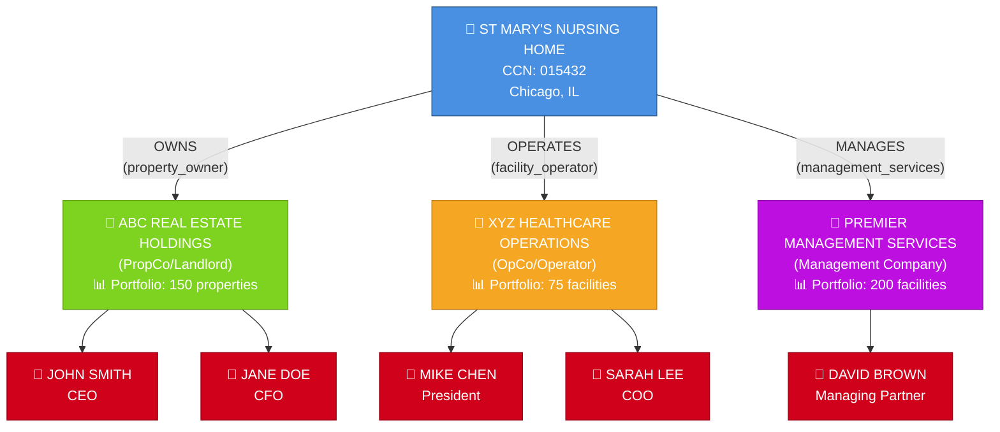

# Visualization 1: The Concept Graph
## The Core Problem & Solution

## The Critical Insight

**ONE PROPERTY → MULTIPLE COMPANIES (different roles) → MULTIPLE PRINCIPALS (different portfolios)**

### The Complexity:
- **ABC Real Estate** owns 150 properties (only 50 are nursing homes)
- **XYZ Healthcare** operates 75 nursing homes (but only OWNS 10 of them!)
- **65 of XYZ's facilities are LEASED** from other landlords
- **Same principal** could appear in multiple companies
- **Operating portfolio ≠ Ownership portfolio ≠ Management portfolio**

### The Solution:
The `relationship_type` field in the junction table allows one property to connect to multiple companies, each with a different role:
- `property_owner` (Propco/Landlord)
- `facility_operator` (Opco/Runs the nursing home)
- `management_services` (Admin/consulting)
- `lender` (Mortgage holder)

---

## Color Legend:
- 🔵 **Blue** = Properties (nursing homes)
- 🟢 **Green** = Propco/Landlord companies (own real estate)
- 🟠 **Orange** = Opco companies (operate facilities)
- 🟣 **Purple** = Management companies (provide services)
- 🔴 **Red** = Principals (individual people)

---

## How to Use This Diagram:
1. **For stakeholders:** Shows why the graph structure matters (reveals hidden relationships)
2. **For developers:** Shows the entities and relationships to model
3. **For validation:** Test queries should return this exact structure for a given property
