# Visualization 1: The Concept Graph
## The Core Problem & Solution

```mermaid
graph TB
    Property["🏥 ST MARY'S NURSING HOME<br/>CCN: 015432<br/>Chicago, IL"]
    
    PropCo["🏢 ABC REAL ESTATE HOLDINGS<br/>(PropCo/Landlord)<br/>📊 Portfolio: 150 properties"]
    OpCo["🏥 XYZ HEALTHCARE OPERATIONS<br/>(OpCo/Operator)<br/>📊 Portfolio: 75 facilities"]
    MgmtCo["💼 PREMIER MANAGEMENT SERVICES<br/>(Management Company)<br/>📊 Portfolio: 200 facilities"]
    
    John["👤 JOHN SMITH<br/>CEO"]
    Jane["👤 JANE DOE<br/>CFO"]
    Mike["👤 MIKE CHEN<br/>President"]
    Sarah["👤 SARAH LEE<br/>COO"]
    David["👤 DAVID BROWN<br/>Managing Partner"]
    
    Property -->|"OWNS<br/>(property_owner)"| PropCo
    Property -->|"OPERATES<br/>(facility_operator)"| OpCo
    Property -->|"MANAGES<br/>(management_services)"| MgmtCo
    
    PropCo --> John
    PropCo --> Jane
    OpCo --> Mike
    OpCo --> Sarah
    MgmtCo --> David
    
    classDef property fill:#4A90E2,stroke:#2E5C8A,color:#fff
    classDef propco fill:#7ED321,stroke:#5FA319,color:#fff
    classDef opco fill:#F5A623,stroke:#C77E1A,color:#fff
    classDef mgmt fill:#BD10E0,stroke:#8B0AA8,color:#fff
    classDef principal fill:#D0021B,stroke:#9A0114,color:#fff
    
    class Property property
    class PropCo propco
    class OpCo opco
    class MgmtCo mgmt
    class John,Jane,Mike,Sarah,David principal
```

## The Critical Insight

**ONE PROPERTY → MULTIPLE COMPANIES (different roles) → MULTIPLE PRINCIPALS (different portfolios)**

### The Complexity:
- **ABC Real Estate** owns 150 properties (only 50 are nursing homes)
- **XYZ Healthcare** operates 75 nursing homes (but only OWNS 10 of them!)
- **65 of XYZ's facilities are LEASED** from other landlords
- **Same principal** could appear in multiple companies
- **Operating portfolio ≠ Ownership portfolio ≠ Management portfolio**

### The Solution:
The `relationship_type` field in the junction table allows one property to connect to multiple companies, each with a different role:
- `property_owner` (Propco/Landlord)
- `facility_operator` (Opco/Runs the nursing home)
- `management_services` (Admin/consulting)
- `lender` (Mortgage holder)

---

## Color Legend:
- 🔵 **Blue** = Properties (nursing homes)
- 🟢 **Green** = Propco/Landlord companies (own real estate)
- 🟠 **Orange** = Opco companies (operate facilities)
- 🟣 **Purple** = Management companies (provide services)
- 🔴 **Red** = Principals (individual people)

---

## How to Use This Diagram:
1. **For stakeholders:** Shows why the graph structure matters (reveals hidden relationships)
2. **For developers:** Shows the entities and relationships to model
3. **For validation:** Test queries should return this exact structure for a given property
