# Visualization 2: The Data Sources Map
## Where Data Comes From & How It Flows Together

```mermaid
flowchart TB
    subgraph Sources["DATA SOURCES"]
        CMS["📋 CMS (Medicare)<br/>─────────────<br/>• CCN (Facility ID)<br/>• Affiliated Entities<br/>• Owner Records<br/>• Quality Metrics<br/>─────────────<br/>Update: Monthly"]
        
        REAPI["🏘️ REAPI (Real Estate)<br/>─────────────<br/>• Property ID<br/>• Owner1Full<br/>• OwnerAddress<br/>• Sales History<br/>─────────────<br/>Update: Weekly"]
        
        Zoho["💼 ZOHO CRM<br/>─────────────<br/>• Account ID (Properties)<br/>• Contact Records<br/>• Company Records<br/>• Manual Relationships<br/>─────────────<br/>Update: Daily Sync"]
    end
    
    subgraph Extract["WHAT EACH SOURCE PROVIDES"]
        CMS_Data["CMS Provides:<br/>• Opco Companies<br/>  (Affiliated Entities)<br/>• Individual Owners<br/>  (Principals)<br/>• Facility Operator Info"]
        
        REAPI_Data["REAPI Provides:<br/>• Propco Companies<br/>  (Property Owners)<br/>• Real Estate Data<br/>• Owner Addresses<br/>  (for matching)"]
        
        Zoho_Data["Zoho Provides:<br/>• Principal Records<br/>• Manual Company Links<br/>• Relationship Metadata<br/>• Property IDs"]
    end
    
    subgraph Database["🗄️ MYSQL DATABASE"]
        Master["property_master<br/>─────────────<br/>• CCN ← from CMS<br/>• reapi_property_id ← from REAPI<br/>• zoho_account_id ← from Zoho<br/>─────────────<br/>THE ROSETTA STONE"]
        
        Companies["companies<br/>─────────────<br/>• Opco (from CMS)<br/>• Propco (from REAPI)<br/>• Management (from CMS)<br/>• zoho_company_id ← from Zoho"]
        
        PropCompany["property_company_relationships<br/>─────────────<br/>• relationship_type:<br/>  - property_owner (REAPI)<br/>  - facility_operator (CMS)<br/>  - management_services (CMS)<br/>• data_source field tracks origin"]
        
        PrincCompany["principal_company_relationships<br/>─────────────<br/>• Matched from CMS owners<br/>• Enriched from Zoho<br/>• role field (CEO, Owner, etc.)"]
        
        Principals["principals<br/>─────────────<br/>• From CMS individual owners<br/>• From Zoho contacts<br/>• Matched via normalized names<br/>  + addresses (60% rule)"]
        
        Deals["deals + deal_participants<br/>─────────────<br/>• Sales (from REAPI)<br/>• CHOWs (from CMS)<br/>• Buyer/Seller/Lender roles<br/>• Transaction history"]
        
        Markets["markets + segments<br/>─────────────<br/>• Geographic markets<br/>• Behavioral segments<br/>• Company tagging<br/>• Market activity tracking"]
    end
    
    CMS --> CMS_Data
    REAPI --> REAPI_Data
    Zoho --> Zoho_Data
    
    CMS_Data -->|"CCN +<br/>Facility Info"| Master
    REAPI_Data -->|"Property ID<br/>(via CCN link)"| Master
    Zoho_Data -->|"Account ID<br/>(manual mapping)"| Master
    
    CMS_Data -->|"Affiliated<br/>Entities"| Companies
    REAPI_Data -->|"Owner1Full"| Companies
    Zoho_Data -->|"Company<br/>Records"| Companies
    
    CMS_Data -->|"Facility →<br/>Affiliated Entity"| PropCompany
    REAPI_Data -->|"Property →<br/>Owner"| PropCompany
    
    CMS_Data -->|"Individual<br/>Owners"| Principals
    Zoho_Data -->|"Contact<br/>Records"| Principals
    
    Companies --> PrincCompany
    Principals --> PrincCompany
    
    REAPI_Data -->|"Sales History"| Deals
    CMS_Data -->|"CHOWs"| Deals
    Companies -->|"Buyer/Seller"| Deals
    
    Master -->|"Geography"| Markets
    Companies -->|"Tagging"| Markets
    
    classDef source fill:#E8F4F8,stroke:#2E5C8A,stroke-width:2px
    classDef extract fill:#FFF8E1,stroke:#F57C00,stroke-width:2px
    classDef master fill:#E8F5E9,stroke:#388E3C,stroke-width:3px
    classDef table fill:#F3E5F5,stroke:#7B1FA2,stroke-width:2px
    classDef deals fill:#FFEBEE,stroke:#C62828,stroke-width:2px
    classDef markets fill:#E3F2FD,stroke:#1565C0,stroke-width:2px
    
    class CMS,REAPI,Zoho source
    class CMS_Data,REAPI_Data,Zoho_Data extract
    class Master master
    class Companies,PropCompany,PrincCompany,Principals table
    class Deals deals
    class Markets markets
```



## Key Data Flow Patterns

### 1. The Master Linking Table (property_master)
**Purpose:** Single source of truth linking all three identifier systems

**Build Sequence:**
1. Load CCN from CMS (primary source - 15K facilities)
2. Add REAPI Property ID via `reapi_nursing_homes.ccn` join (~90% coverage)
3. Add Zoho Account ID from daily CRM sync

### 2. Company Layer
**Two sources feed different company types:**

**From CMS:**
- `Affiliated Entities` → Opco companies (facility operators)
- Relationship: `facility_operator`

**From REAPI:**
- `Owner1Full` → Propco companies (property owners/landlords)
- Relationship: `property_owner`

### 3. The 60% Rule (CMS ↔ REAPI Principal Matching)
**Critical insight:** 60% of CMS individual owners also appear in REAPI as property owners

**Matching strategy:**
1. Standardize addresses from both sources
2. When `CMS owner address` = `REAPI owner address` → Same principal
3. Creates link between Opco and Propco companies through shared principal

**Example:**
```
CMS: John Smith, 980 Sylvan Ave, Englewood Cliffs, NJ 07632
      ↓ (owner of Portopicolo Group - Opco)

REAPI: Owner at 980 Sylvan Ave, Englewd Clfs, NJ 07632
       ↓ (owner of Panama City FL Propco LLC - Propco)

MATCH! → John Smith controls BOTH Opco AND Propco
```

## Data Quality Tracking

Each record tracks its source:
```sql
property_company_relationships.data_source:
  - 'cms'      → From CMS Affiliated Entity
  - 'reapi'    → From REAPI Owner1Full
  - 'zoho'     → From manual CRM entry
  - 'manual'   → Human-verified
  - 'web_scrape' → From external research
```

## Update Frequencies

| Source | Update Frequency | What Changes |
|--------|-----------------|--------------|
| **CMS** | Monthly | Affiliated entities, owner records, quality metrics |
| **REAPI** | Weekly | Property ownership, sales transactions |
| **Zoho** | Daily (automated sync) | Manual relationships, contact updates |
| **Web/SOS** | On-demand | Research to fill gaps |

---

## How to Use This Map:

**For developers:**
- Understand which table gets data from which source
- Know the data_source field for provenance tracking

**For data validation:**
- Check update timestamps to ensure fresh data
- Verify linkages between CCN ↔ Property ID ↔ Account ID

**For stakeholders:**
- Shows why multiple data sources are needed
- Explains why some data is more current than others
