# Visualization 3: The Schema ERD (Entity Relationship Diagram)
## Complete Database Structure for Phase I

```mermaid
erDiagram
    property_master ||--o{ property_company_relationships : "has many"
    property_master ||--o{ deals : "has transactions"
    property_master }o--o{ markets : "located in"
    companies ||--o{ property_company_relationships : "has many"
    companies ||--o{ principal_company_relationships : "has many"
    companies ||--o{ deal_participants : "participates in"
    companies }o--o{ segments : "tagged with"
    principals ||--o{ principal_company_relationships : "has many"
    deals ||--o{ deal_participants : "has participants"
    markets ||--o{ market_activity : "has activity"
    
    property_master {
        int id PK "Auto-increment"
        varchar ccn UK "CMS Certification Number"
        int reapi_property_id UK "REAPI Property ID"
        varchar zoho_account_id UK "Zoho Account/Property Record ID"
        varchar facility_name "Facility name"
        varchar address "Street address"
        varchar city "City"
        char state "State (2-letter)"
        varchar zip "ZIP code"
        decimal latitude "Geocoded latitude"
        decimal longitude "Geocoded longitude"
        decimal data_quality_score "0.00-1.00 linkage confidence"
        timestamp created_at
        timestamp updated_at
        timestamp last_synced_from_zoho
        timestamp last_synced_from_cms
        timestamp last_synced_from_reapi
    }
    
    companies {
        int id PK "Auto-increment"
        varchar company_name "Legal business name"
        enum company_type "opco|propco|management|holding|pe_firm|reit|other"
        varchar dba_name "Doing business as"
        varchar ein "Employer ID Number"
        varchar cms_affiliated_entity_id "Links to CMS affiliated entity"
        varchar cms_affiliated_entity_name "CMS entity name"
        varchar address "HQ address"
        varchar city "City"
        char state "State"
        varchar zip "ZIP"
        char state_of_incorporation "State of incorporation"
        int primary_contact_principal_id FK "FK to principals.id"
        varchar website "Company website"
        varchar zoho_company_id UK "Zoho Companies module record ID"
        timestamp created_at
        timestamp updated_at
        timestamp last_synced_from_zoho
        text notes
    }
    
    property_company_relationships {
        int id PK "Auto-increment"
        int property_master_id FK "FK to property_master.id"
        int company_id FK "FK to companies.id"
        enum relationship_type "THE CRITICAL FIELD - property_owner|facility_operator|management_services|lender|parent_company|affiliate|consultant|other"
        decimal ownership_percentage "0.00-100.00"
        date effective_date "When relationship started"
        date end_date "NULL means current relationship"
        enum data_source "cms|reapi|zoho|manual|web_scrape"
        bool verified "Human-verified flag"
        varchar zoho_junction_record_id UK "Zoho CompanyxProperty record ID"
        timestamp created_at
        timestamp updated_at
        text notes
    }
    
    principals {
        int id PK "Auto-increment"
        varchar first_name "First name"
        varchar last_name "Last name"
        varchar full_name "Full name"
        varchar normalized_full_name UK "UPPERCASE standardized for matching"
        varchar email "Email address"
        varchar phone "Phone number"
        varchar linkedin_url "LinkedIn profile"
        varchar zoho_contact_id UK "Zoho Contacts/Principals record ID"
        timestamp created_at
        timestamp updated_at
    }
    
    principal_company_relationships {
        int id PK "Auto-increment"
        int principal_id FK "FK to principals.id"
        int company_id FK "FK to companies.id"
        enum role "ceo|president|cfo|coo|board_member|managing_partner|general_partner|limited_partner|owner_direct|owner_indirect|officer|manager|member|other"
        decimal ownership_percentage "0.00-100.00"
        date effective_date "When they assumed role"
        date end_date "NULL means current role"
        bool is_primary "Primary decision maker flag"
        enum data_source "cms|zoho|manual|web_scrape|sos_filing"
        varchar zoho_junction_record_id UK "Zoho CompanyxPrincipal record ID"
        timestamp created_at
        timestamp updated_at
    }
    
    deals {
        int id PK "Auto-increment"
        enum deal_type "sale|refinance|chow|new_financing|lease_assignment|recapitalization|foreclosure|other"
        date deal_date "Transaction date"
        decimal transaction_amount "Deal value"
        int property_master_id FK "FK to property_master.id (can be NULL for portfolio deals)"
        varchar document_type "ACRIS_DEED|CMS_CHOW|REAPI_SALE|etc"
        varchar document_id "External document ID"
        text document_url "Link to source document"
        enum data_source "reapi|acris|cms_chow|manual|web_scrape"
        bool verified "Human-verified flag"
        text notes
        timestamp created_at
        timestamp updated_at
    }
    
    deal_participants {
        int id PK "Auto-increment"
        int deal_id FK "FK to deals.id"
        int company_id FK "FK to companies.id"
        enum participant_role "buyer|seller|lender|borrower|previous_operator|new_operator|guarantor|investor|broker|other"
        decimal ownership_percentage "For partial sales/equity deals"
        decimal investment_amount "Their specific contribution"
        enum data_source "reapi|acris|cms_chow|manual|web_scrape"
        text notes
        timestamp created_at
    }
    
    markets {
        int id PK "Auto-increment"
        varchar market_name UK "e.g. Florida SNF, NYC Metro"
        varchar market_type "state|msa|county|custom"
        varchar state "State code if applicable"
        varchar msa_code "MSA code if applicable"
        text geography_definition "JSON or description of boundaries"
        int property_count "Cached count of properties"
        decimal total_beds "Cached total beds in market"
        timestamp created_at
        timestamp updated_at
    }
    
    segments {
        int id PK "Auto-increment"
        varchar segment_name UK "e.g. Quality-First Operator, PE-Backed"
        varchar segment_type "behavioral|ownership|strategic|quality"
        text segment_criteria "JSON definition of segment rules"
        text description "Human-readable description"
        int company_count "Cached count of companies"
        timestamp created_at
        timestamp updated_at
    }
    
    company_segments {
        int id PK "Auto-increment"
        int company_id FK "FK to companies.id"
        int segment_id FK "FK to segments.id"
        decimal confidence_score "0.00-1.00 match confidence"
        enum assignment_type "auto|manual|ai_suggested"
        date effective_date "When segment applied"
        date end_date "NULL means current"
        timestamp created_at
    }
    
    property_markets {
        int id PK "Auto-increment"
        int property_master_id FK "FK to property_master.id"
        int market_id FK "FK to markets.id"
        bool is_primary "Primary market flag"
        timestamp created_at
    }
    
    market_activity {
        int id PK "Auto-increment"
        int market_id FK "FK to markets.id"
        date activity_date "Date of snapshot"
        int deal_count "Transactions in period"
        decimal deal_volume "Total dollar volume"
        int chow_count "CHOWs in period"
        decimal avg_price_per_bed "Market benchmark"
        decimal occupancy_rate "Market average"
        timestamp created_at
    }
```



## Critical Indexes

### property_master
```sql
PRIMARY KEY (id)
UNIQUE KEY (ccn)
UNIQUE KEY (reapi_property_id)
UNIQUE KEY (zoho_account_id)
INDEX (state, city)
INDEX (facility_name)
```

### companies
```sql
PRIMARY KEY (id)
UNIQUE KEY (zoho_company_id)
INDEX (company_name)
INDEX (company_type)
INDEX (cms_affiliated_entity_id)
INDEX (state)
FOREIGN KEY (primary_contact_principal_id) REFERENCES principals(id)
```

### property_company_relationships
```sql
PRIMARY KEY (id)
FOREIGN KEY (property_master_id) REFERENCES property_master(id)
FOREIGN KEY (company_id) REFERENCES companies(id)
UNIQUE KEY (property_master_id, company_id, relationship_type, end_date)
INDEX (property_master_id, end_date)  -- Critical for "current" lookups
INDEX (company_id, end_date)           -- Critical for portfolio queries
INDEX (relationship_type)
INDEX (data_source)
INDEX (property_master_id, relationship_type)  -- Filter by role
UNIQUE KEY (zoho_junction_record_id)
```

### principals
```sql
PRIMARY KEY (id)
UNIQUE KEY (normalized_full_name)
UNIQUE KEY (zoho_contact_id)
INDEX (full_name)
```

### principal_company_relationships
```sql
PRIMARY KEY (id)
FOREIGN KEY (principal_id) REFERENCES principals(id)
FOREIGN KEY (company_id) REFERENCES companies(id)
UNIQUE KEY (principal_id, company_id, role, end_date)
INDEX (principal_id, end_date)  -- Current roles for principal
INDEX (company_id, end_date)    -- Current principals for company
INDEX (role)
UNIQUE KEY (zoho_junction_record_id)
```

### deals
```sql
PRIMARY KEY (id)
FOREIGN KEY (property_master_id) REFERENCES property_master(id)
INDEX (property_master_id)
INDEX (deal_date)
INDEX (deal_type)
INDEX (data_source)
```

### deal_participants
```sql
PRIMARY KEY (id)
FOREIGN KEY (deal_id) REFERENCES deals(id) ON DELETE CASCADE
FOREIGN KEY (company_id) REFERENCES companies(id)
UNIQUE KEY (deal_id, company_id, participant_role)
INDEX (deal_id)
INDEX (company_id)
INDEX (participant_role)
```

### markets
```sql
PRIMARY KEY (id)
UNIQUE KEY (market_name)
INDEX (market_type)
INDEX (state)
```

### segments
```sql
PRIMARY KEY (id)
UNIQUE KEY (segment_name)
INDEX (segment_type)
```

### company_segments
```sql
PRIMARY KEY (id)
FOREIGN KEY (company_id) REFERENCES companies(id)
FOREIGN KEY (segment_id) REFERENCES segments(id)
UNIQUE KEY (company_id, segment_id, end_date)
INDEX (company_id, end_date)  -- Current segments for company
INDEX (segment_id, end_date)  -- Companies in segment
INDEX (assignment_type)
```

### property_markets
```sql
PRIMARY KEY (id)
FOREIGN KEY (property_master_id) REFERENCES property_master(id)
FOREIGN KEY (market_id) REFERENCES markets(id)
UNIQUE KEY (property_master_id, market_id)
INDEX (market_id)  -- Properties in market
INDEX (is_primary)  -- Primary market lookups
```

### market_activity
```sql
PRIMARY KEY (id)
FOREIGN KEY (market_id) REFERENCES markets(id)
INDEX (market_id, activity_date)  -- Time series queries
INDEX (activity_date)  -- Cross-market comparisons
```

## Key Design Decisions

### 1. Temporal Tracking with end_date
**Pattern:** `end_date IS NULL` = current relationship

**Why:** Preserves history without deleting data
```sql
-- Get current relationships only
WHERE end_date IS NULL

-- Get all relationships (current + historical)
-- No WHERE clause needed
```

### 2. The relationship_type Enum
**This is THE critical field** that allows one property to have multiple companies.

**Values:**
- `property_owner` - Propco/Landlord (from REAPI)
- `facility_operator` - Opco/Runs the nursing home (from CMS)
- `management_services` - Admin/consulting (from CMS)
- `lender` - Mortgage holder (from REAPI)
- `parent_company` - Corporate parent
- `affiliate` - Related entity
- `consultant` - Advisory services
- `other` - Catch-all

### 3. The role Enum (Principal → Company)
**Distinguishes different types of involvement:**

**Ownership:**
- `owner_direct` - 5%+ direct ownership (CMS code 34)
- `owner_indirect` - 5%+ indirect ownership (CMS code 35)

**Executive:**
- `ceo`, `president`, `cfo`, `coo`

**Board/Partnership:**
- `board_member` - Corporate board (CMS code 43)
- `managing_partner`, `general_partner`, `limited_partner`

**LLC Structure:**
- `member` - LLC member (CMS code 44)
- `manager` - LLC manager (CMS code 45)

### 4. Data Source Tracking
Every relationship tracks where it came from:
```sql
data_source ENUM('cms', 'reapi', 'zoho', 'manual', 'web_scrape', 'sos_filing')
```

**Why:** For debugging, validation, and knowing which data to trust

### 5. Zoho Linkage Fields
**Every table has a Zoho ID field** to maintain sync:
- `property_master.zoho_account_id`
- `companies.zoho_company_id`
- `principals.zoho_contact_id`
- Junction tables: `zoho_junction_record_id`

**Why:** Enables bidirectional sync (SQL ↔ Zoho)

## Critical Graph Queries Enabled by This Schema

### Query 1: Get all companies for a property
```sql
SELECT c.company_name, pcr.relationship_type
FROM property_master pm
JOIN property_company_relationships pcr ON pcr.property_master_id = pm.id
JOIN companies c ON c.id = pcr.company_id
WHERE pm.ccn = '015432' AND pcr.end_date IS NULL;
```

### Query 2: Get company's complete portfolio
```sql
SELECT pm.facility_name, pcr.relationship_type
FROM companies c
JOIN property_company_relationships pcr ON pcr.company_id = c.id
JOIN property_master pm ON pm.id = pcr.property_master_id
WHERE c.company_name = 'XYZ Healthcare' AND pcr.end_date IS NULL;
```

### Query 3: Get principal's complete network
```sql
SELECT c.company_name, prc.role
FROM principals p
JOIN principal_company_relationships prc ON prc.principal_id = p.id
JOIN companies c ON c.id = prc.company_id
WHERE p.full_name = 'John Smith' AND prc.end_date IS NULL;
```

### Query 4: Find lease situations (owner ≠ operator)
```sql
SELECT pm.facility_name, 
       owner_c.company_name as owner,
       operator_c.company_name as operator
FROM property_master pm
JOIN property_company_relationships owner_pcr 
  ON owner_pcr.property_master_id = pm.id 
  AND owner_pcr.relationship_type = 'property_owner'
  AND owner_pcr.end_date IS NULL
JOIN companies owner_c ON owner_c.id = owner_pcr.company_id
JOIN property_company_relationships operator_pcr 
  ON operator_pcr.property_master_id = pm.id 
  AND operator_pcr.relationship_type = 'facility_operator'
  AND operator_pcr.end_date IS NULL
JOIN companies operator_c ON operator_c.id = operator_pcr.company_id
WHERE owner_c.id != operator_c.id;
```

### Query 5: Transaction history for a property
```sql
SELECT 
    d.deal_date,
    d.deal_type,
    d.transaction_amount,
    buyer_c.company_name as buyer,
    seller_c.company_name as seller,
    lender_c.company_name as lender
FROM deals d
JOIN property_master pm ON pm.id = d.property_master_id
LEFT JOIN deal_participants buyer_dp ON buyer_dp.deal_id = d.id AND buyer_dp.participant_role = 'buyer'
LEFT JOIN companies buyer_c ON buyer_c.id = buyer_dp.company_id
LEFT JOIN deal_participants seller_dp ON seller_dp.deal_id = d.id AND seller_dp.participant_role = 'seller'
LEFT JOIN companies seller_c ON seller_c.id = seller_dp.company_id
LEFT JOIN deal_participants lender_dp ON lender_dp.deal_id = d.id AND lender_dp.participant_role = 'lender'
LEFT JOIN companies lender_c ON lender_c.id = lender_dp.company_id
WHERE pm.ccn = '105678'
ORDER BY d.deal_date DESC;
```

### Query 6: Find strategic partnerships (repeat buyer/seller pairs)
```sql
SELECT 
    buyer_c.company_name as buyer,
    seller_c.company_name as seller,
    COUNT(*) as transaction_count,
    SUM(d.transaction_amount) as total_volume
FROM deals d
JOIN deal_participants buyer_dp ON buyer_dp.deal_id = d.id AND buyer_dp.participant_role = 'buyer'
JOIN companies buyer_c ON buyer_c.id = buyer_dp.company_id
JOIN deal_participants seller_dp ON seller_dp.deal_id = d.id AND seller_dp.participant_role = 'seller'
JOIN companies seller_c ON seller_c.id = seller_dp.company_id
WHERE d.deal_type = 'sale'
GROUP BY buyer_c.id, seller_c.id
HAVING transaction_count > 1
ORDER BY transaction_count DESC;
```

### Query 7: Get companies by segment
```sql
SELECT 
    c.company_name,
    c.company_type,
    cs.confidence_score,
    cs.assignment_type
FROM segments s
JOIN company_segments cs ON cs.segment_id = s.id
JOIN companies c ON c.id = cs.company_id
WHERE s.segment_name = 'Quality-First Operator'
  AND cs.end_date IS NULL
ORDER BY cs.confidence_score DESC;
```

### Query 8: Get market activity summary
```sql
SELECT 
    m.market_name,
    m.property_count,
    ma.deal_count,
    ma.deal_volume,
    ma.avg_price_per_bed,
    ma.activity_date
FROM markets m
JOIN market_activity ma ON ma.market_id = m.id
WHERE m.market_type = 'state'
  AND ma.activity_date >= DATE_SUB(CURRENT_DATE, INTERVAL 12 MONTH)
ORDER BY m.market_name, ma.activity_date DESC;
```

### Query 9: Find properties in market by segment
```sql
SELECT 
    pm.facility_name,
    pm.city,
    c.company_name as operator,
    s.segment_name
FROM property_master pm
JOIN property_markets pmk ON pmk.property_master_id = pm.id
JOIN markets m ON m.id = pmk.market_id
JOIN property_company_relationships pcr ON pcr.property_master_id = pm.id
    AND pcr.relationship_type = 'facility_operator'
    AND pcr.end_date IS NULL
JOIN companies c ON c.id = pcr.company_id
JOIN company_segments cs ON cs.company_id = c.id AND cs.end_date IS NULL
JOIN segments s ON s.id = cs.segment_id
WHERE m.market_name = 'Florida SNF'
  AND s.segment_name = 'PE-Backed'
ORDER BY pm.facility_name;
```

## Validation Queries

### Check data quality
```sql
SELECT 
  COUNT(*) as total_properties,
  AVG(data_quality_score) as avg_quality,
  COUNT(DISTINCT zoho_account_id) as with_zoho,
  COUNT(DISTINCT reapi_property_id) as with_reapi
FROM property_master;
```

### Find properties with multiple companies
```sql
SELECT pm.facility_name, COUNT(DISTINCT pcr.company_id) as company_count
FROM property_master pm
JOIN property_company_relationships pcr ON pcr.property_master_id = pm.id
WHERE pcr.end_date IS NULL
GROUP BY pm.id
HAVING company_count > 1
ORDER BY company_count DESC;
```

### Find principals in multiple companies
```sql
SELECT p.full_name, COUNT(DISTINCT prc.company_id) as company_count
FROM principals p
JOIN principal_company_relationships prc ON prc.principal_id = p.id
WHERE prc.end_date IS NULL
GROUP BY p.id
HAVING company_count > 1
ORDER BY company_count DESC;
```

---

## How to Use This ERD:

**For developers implementing the schema:**
- Copy table definitions exactly
- Implement all indexes (critical for performance)
- Set up foreign keys for referential integrity

**For writing queries:**
- Always filter `end_date IS NULL` for current relationships
- Use composite indexes (property_id, end_date) for best performance

**For data validation:**
- Run the validation queries after each data load
- Check that foreign keys prevent orphaned records
