# Visualization 4: The Zoho Module Map
## CRM Structure & Configuration Needed

```mermaid
graph TB
    subgraph Existing["✅ EXISTING MODULES"]
        Accounts["📋 ACCOUNTS/PROPERTIES<br/>─────────────<br/>Standard Module<br/>─────────────<br/>• Account Name<br/>• CCN (Custom Field)<br/>• Property Address<br/>• City, State, ZIP"]
        
        Contacts["👤 CONTACTS/PRINCIPALS<br/>─────────────<br/>Standard Module<br/>─────────────<br/>• First Name<br/>• Last Name<br/>• Email<br/>• Phone<br/>• Title"]
        
        PxP["🔗 PrincipalxProperty<br/>─────────────<br/>Existing Junction<br/>─────────────<br/>• Principal_Lookup<br/>• Property_Lookup<br/>• Role (Custom)<br/>• Relationship metadata"]
    end
    
    subgraph New["➕ NEW MODULES TO CREATE"]
        Companies["🏢 COMPANIES<br/>─────────────<br/>Custom Module<br/>─────────────<br/>• Company_Name<br/>• Company_Type ⭐<br/>• DBA_Name<br/>• EIN<br/>• CMS_Affiliated_Entity_ID<br/>• Address fields<br/>• Website<br/>• Primary_Contact (Lookup)"]
        
        CxP["🔗 CompanyxProperty<br/>─────────────<br/>Junction Module<br/>─────────────<br/>• Property_Lookup<br/>• Company_Lookup<br/>• Relationship_Type ⭐⭐<br/>• Ownership_Percentage<br/>• Effective_Date<br/>• End_Date<br/>• Data_Source<br/>• Verified (Checkbox)<br/>• Notes"]
        
        CxPrinc["🔗 CompanyxPrincipal<br/>─────────────<br/>Junction Module<br/>─────────────<br/>• Company_Lookup<br/>• Principal_Lookup<br/>• Role ⭐<br/>• Ownership_Percentage<br/>• Effective_Date<br/>• End_Date<br/>• Is_Primary (Checkbox)"]
    end
    
    Accounts <-->|"Related List:<br/>CompanyxProperty"| CxP
    Companies <-->|"Related List:<br/>CompanyxProperty"| CxP
    
    Companies <-->|"Related List:<br/>CompanyxPrincipal"| CxPrinc
    Contacts <-->|"Related List:<br/>CompanyxPrincipal"| CxPrinc
    
    Accounts -.->|"Existing:<br/>PrincipalxProperty"| PxP
    Contacts -.->|"Existing:<br/>PrincipalxProperty"| PxP
    
    classDef existing fill:#E8F5E9,stroke:#388E3C,stroke-width:2px
    classDef new fill:#FFF8E1,stroke:#F57C00,stroke-width:2px
    classDef critical fill:#FFEBEE,stroke:#C62828,stroke-width:3px
    
    class Accounts,Contacts,PxP existing
    class Companies,CxP,CxPrinc new
```



## Field Configuration Details

### 🏢 COMPANIES Module (New Custom Module)

| Field Name | Field Type | Configuration | Purpose |
|------------|------------|---------------|---------|
| **Company_Name** | Single Line | Required, Max 255 chars | Legal business name |
| **Company_Type** ⭐ | Picklist | Required, Single-select | Opco, Propco, Management, Holding, PE Firm, REIT, Other |
| **DBA_Name** | Single Line | Optional, Max 255 chars | Doing business as name |
| **EIN** | Single Line | Optional, Max 20 chars | Employer Identification Number |
| **CMS_Affiliated_Entity_ID** | Single Line | Optional, Max 50 chars | Links to CMS affiliated entity |
| **Company_Address** | Address | Street, City, State, ZIP | Headquarters address |
| **State_of_Incorporation** | Picklist | State list | Where incorporated |
| **Primary_Contact** | Lookup | Links to Contacts/Principals | Main contact person |
| **Website** | URL | Optional | Company website |
| **Notes** | Long Text | Optional | Additional information |

**Company_Type Picklist Values:**
```
- Opco (Operating Company)
- Propco (Property Owner / Landlord)
- Management Company
- Holding Company
- PE Firm
- REIT
- Other
```

---

### 🔗 CompanyxProperty Module (New Junction Module)

**⚠️ THIS IS THE CRITICAL MODULE** - Enables one property to have multiple companies with different roles

| Field Name | Field Type | Configuration | Purpose |
|------------|------------|---------------|---------|
| **Property_Lookup** | Lookup | Required, Links to Accounts/Properties | The property |
| **Company_Lookup** | Lookup | Required, Links to Companies | The company |
| **Relationship_Type** ⭐⭐ | Picklist | Required, Single-select | **THE KEY FIELD** |
| **Ownership_Percentage** | Decimal | Optional, 0-100, 2 decimals | % ownership if applicable |
| **Effective_Date** | Date | Required | When relationship started |
| **End_Date** | Date | Optional | NULL = current relationship |
| **Data_Source** | Picklist | Required | Where data came from |
| **Verified** | Checkbox | Default: False | Human-verified flag |
| **Notes** | Long Text | Optional | Additional context |

**Relationship_Type Picklist Values:** ⭐⭐ **CRITICAL**
```
- Property Owner (Propco/Landlord)
- Facility Operator (Opco/Runs the nursing home)
- Management Services (Admin/consulting)
- Lender (Mortgage holder)
- Parent Company
- Affiliate
- Consultant
- Other
```

**Data_Source Picklist Values:**
```
- CMS (From Medicare data)
- REAPI (From real estate data)
- Zoho Manual Entry
- Web Research
- SOS Filing
```

**Validation Rules:**
- Property_Lookup + Company_Lookup must be unique for active relationships
- If End_Date is blank, relationship is considered current
- Ownership_Percentage must be between 0 and 100

---

### 🔗 CompanyxPrincipal Module (New Junction Module)

**Purpose:** Links principals to companies with their specific roles

| Field Name | Field Type | Configuration | Purpose |
|------------|------------|---------------|---------|
| **Principal_Lookup** | Lookup | Required, Links to Contacts/Principals | The person |
| **Company_Lookup** | Lookup | Required, Links to Companies | The company |
| **Role** ⭐ | Picklist | Required, Single-select | Principal's role in company |
| **Ownership_Percentage** | Decimal | Optional, 0-100, 2 decimals | % ownership stake |
| **Effective_Date** | Date | Optional | When they assumed role |
| **End_Date** | Date | Optional | NULL = current role |
| **Is_Primary** | Checkbox | Default: False | Primary decision maker |

**Role Picklist Values:** ⭐
```
- CEO / Chief Executive Officer
- President
- CFO / Chief Financial Officer
- COO / Chief Operating Officer
- Board Member / Director
- Managing Partner
- General Partner
- Limited Partner
- Owner (5%+ Direct)
- Owner (5%+ Indirect)
- Officer
- Manager (LLC)
- Member (LLC)
- Other
```

---

## Module Relationships & Navigation

### From Property Record (Accounts Module):

**User can see:**
1. **Related List: CompanyxProperty**
   - Shows all companies related to this property
   - Displays relationship type (Owner, Operator, Manager, etc.)
   - Can add new company relationships

2. **Via CompanyxProperty → Companies**
   - Click company name to view company details
   
3. **Via Company → CompanyxPrincipal → Principals**
   - Navigate from property → companies → principals

### From Company Record (Companies Module):

**User can see:**
1. **Related List: CompanyxProperty**
   - Shows all properties this company is related to
   - Grouped by relationship type (e.g., all properties owned vs operated)

2. **Related List: CompanyxPrincipal**
   - Shows all principals involved with this company
   - Displays their roles

### From Principal Record (Contacts Module):

**User can see:**
1. **Related List: CompanyxPrincipal**
   - Shows all companies this principal is involved with
   - Displays their role in each company

2. **Via CompanyxPrincipal → Companies → CompanyxProperty → Properties**
   - Navigate from principal → companies → properties

---

## Zoho API Endpoints

### Fetch Property's Companies
```
GET /crm/v8/Accounts/{property_id}/CompanyxProperty
```

Returns:
```json
{
  "data": [
    {
      "id": "junction_record_id",
      "Property_Lookup": {"id": "...", "name": "St Mary's Nursing Home"},
      "Company_Lookup": {"id": "...", "name": "ABC Real Estate Holdings"},
      "Relationship_Type": "Property Owner",
      "Ownership_Percentage": 100.00,
      "Effective_Date": "2020-01-15",
      "End_Date": null,
      "Data_Source": "REAPI"
    },
    {
      "id": "junction_record_id_2",
      "Property_Lookup": {"id": "...", "name": "St Mary's Nursing Home"},
      "Company_Lookup": {"id": "...", "name": "XYZ Healthcare Operations"},
      "Relationship_Type": "Facility Operator",
      "Ownership_Percentage": null,
      "Effective_Date": "2018-03-01",
      "End_Date": null,
      "Data_Source": "CMS"
    }
  ]
}
```

### Fetch Company's Properties
```
GET /crm/v8/Companies/{company_id}/CompanyxProperty
```

### Fetch Principal's Companies
```
GET /crm/v8/Contacts/{principal_id}/CompanyxPrincipal
```

---

## Configuration Steps (Day 3-4 of Implementation)

### Day 3: Create Modules

**Step 1: Create Companies Module**
1. Go to Setup → Customization → Modules and Fields
2. Click "Create Custom Module"
3. Module Name: "Companies"
4. Module Icon: Building/Office icon
5. Add all fields from table above
6. Enable: Activities, Notes, Attachments
7. Set Company_Name as required field

**Step 2: Create CompanyxProperty Junction**
1. Go to Setup → Customization → Modules and Fields
2. Click "Create Custom Module"
3. Module Name: "CompanyxProperty"
4. Module Type: **Linking Module** (this is critical!)
5. Link Between: Accounts (Properties) ↔ Companies
6. Add all fields from table above
7. Make this module **hidden in UI** (users access via Related Lists only)

**Step 3: Create CompanyxPrincipal Junction**
1. Same process as CompanyxProperty
2. Link Between: Companies ↔ Contacts (Principals)
3. Add all fields from table above
4. Hidden in UI

### Day 4: Configure Picklists & Validation

**Configure Relationship_Type Picklist:**
- Go to Companies → CompanyxProperty module
- Edit Relationship_Type field
- Add picklist values in order:
  1. Property Owner
  2. Facility Operator
  3. Management Services
  4. Lender
  5. Parent Company
  6. Affiliate
  7. Consultant
  8. Other

**Configure Role Picklist:**
- Go to CompanyxPrincipal module
- Edit Role field
- Add picklist values (see table above)

**Set up Validation Rules:**
```javascript
// CompanyxProperty: Ownership_Percentage must be 0-100
if (Ownership_Percentage != null) {
  if (Ownership_Percentage < 0 || Ownership_Percentage > 100) {
    alert("Ownership percentage must be between 0 and 100");
    return false;
  }
}

// CompanyxProperty: End_Date must be after Effective_Date
if (End_Date != null && Effective_Date != null) {
  if (End_Date < Effective_Date) {
    alert("End date cannot be before effective date");
    return false;
  }
}
```

---

## Testing Your Configuration

### Test Case 1: One Property, Multiple Companies

**Create:**
1. Property: "St Mary's Nursing Home"
2. Company A: "ABC Real Estate" (Type: Propco)
3. Company B: "XYZ Healthcare" (Type: Opco)

**Link in CompanyxProperty:**
- St Mary's → ABC Real Estate (Relationship: Property Owner)
- St Mary's → XYZ Healthcare (Relationship: Facility Operator)

**Verify:**
- View St Mary's record → Related List shows 2 companies
- View ABC Real Estate → Related List shows St Mary's (as owned property)
- View XYZ Healthcare → Related List shows St Mary's (as operated property)

### Test Case 2: Principal in Multiple Companies

**Create:**
1. Principal: "John Smith"
2. Link to Company A with Role: CEO
3. Link to Company B with Role: Board Member

**Verify:**
- View John Smith → Related List shows 2 companies with different roles
- Each company's record shows John Smith in appropriate role

---

## How to Use This Module Map:

**For Zoho administrators:**
- Follow configuration steps exactly
- Test thoroughly before production use
- Document any customizations

**For developers:**
- Use API endpoints for data sync
- Map Zoho junction record IDs to SQL database
- Handle pagination for large datasets

**For users:**
- Access junction modules via Related Lists only
- Use picklist values consistently
- Set End_Date when relationships terminate
