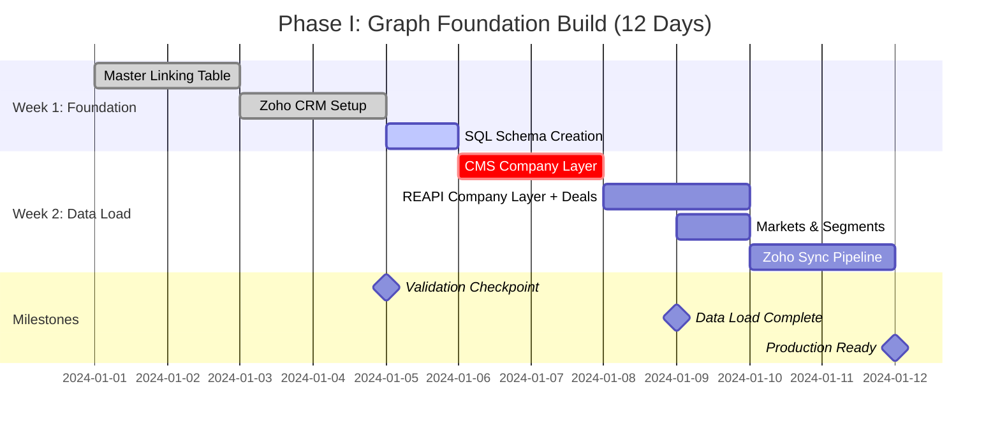

# Visualization 5: The Implementation Roadmap
## 12-Day Sprint to Production



---

## Week 1: Foundation Layer

### **Day 1-2: Master Property Linking Table**

**Objective:** Create single source of truth linking CCN ↔ REAPI ID ↔ Zoho ID

#### Day 1 Tasks:
- [ ] **Create property_master table**
  ```sql
  CREATE TABLE property_master (
      id INT UNSIGNED AUTO_INCREMENT PRIMARY KEY,
      ccn VARCHAR(10) NOT NULL UNIQUE,
      reapi_property_id INT UNSIGNED UNIQUE,
      zoho_account_id VARCHAR(50) UNIQUE,
      facility_name VARCHAR(255) NOT NULL,
      address VARCHAR(500),
      city VARCHAR(100),
      state CHAR(2),
      zip VARCHAR(10),
      data_quality_score DECIMAL(3, 2),
      created_at TIMESTAMP DEFAULT CURRENT_TIMESTAMP,
      updated_at TIMESTAMP DEFAULT CURRENT_TIMESTAMP ON UPDATE CURRENT_TIMESTAMP,
      INDEX idx_ccn (ccn),
      INDEX idx_reapi (reapi_property_id),
      INDEX idx_zoho (zoho_account_id)
  ) ENGINE=InnoDB;
  ```

- [ ] **Load from CMS (primary source)**
  ```sql
  INSERT INTO property_master (ccn, facility_name, address, city, state, zip)
  SELECT 
      ccn,
      provider_name,
      provider_address,
      provider_city,
      provider_state,
      provider_zip_code
  FROM cms_facilities_monthly
  WHERE ccn IS NOT NULL;
  ```
  
  **Expected Result:** ~15,000 rows

- [ ] **Validation Query 1:**
  ```sql
  SELECT COUNT(*) FROM property_master;  -- Should be ~15,000
  SELECT COUNT(DISTINCT ccn) FROM property_master;  -- Should match
  ```

#### Day 2 Tasks:
- [ ] **Add REAPI Property IDs**
  ```sql
  UPDATE property_master pm
  JOIN reapi_nursing_homes rnh ON rnh.ccn = pm.ccn
  SET pm.reapi_property_id = rnh.property_id;
  ```
  
  **Expected Result:** ~90% of rows updated (13,500+)

- [ ] **Add Zoho Account IDs** (from initial CRM export)
  ```sql
  UPDATE property_master pm
  JOIN zoho_accounts_export za ON za.ccn = pm.ccn
  SET pm.zoho_account_id = za.zoho_account_id;
  ```

- [ ] **Calculate data quality scores**
  ```sql
  UPDATE property_master
  SET data_quality_score = (
      CASE WHEN ccn IS NOT NULL THEN 0.33 ELSE 0 END +
      CASE WHEN reapi_property_id IS NOT NULL THEN 0.33 ELSE 0 END +
      CASE WHEN zoho_account_id IS NOT NULL THEN 0.34 ELSE 0 END
  );
  ```

- [ ] **Validation Query 2:**
  ```sql
  SELECT 
      COUNT(*) as total,
      COUNT(DISTINCT ccn) as with_ccn,
      COUNT(DISTINCT reapi_property_id) as with_reapi,
      COUNT(DISTINCT zoho_account_id) as with_zoho,
      AVG(data_quality_score) as avg_quality
  FROM property_master;
  ```
  
  **Expected:** avg_quality ~0.85-0.95

**Day 1-2 Deliverable:** ✅ property_master table with 15K facilities, 90%+ have all 3 IDs

---

### **Day 3-4: Zoho CRM Setup**

**Objective:** Configure Zoho with new modules and junction tables

#### Day 3 Tasks:
- [ ] **Create Companies Module**
  - Navigate to Setup → Customization → Modules and Fields
  - Click "Create Custom Module"
  - Name: "Companies"
  - Add fields:
    - Company_Name (Text, Required)
    - Company_Type (Picklist: Opco, Propco, Management, etc.)
    - DBA_Name (Text)
    - EIN (Text)
    - CMS_Affiliated_Entity_ID (Text)
    - Address fields (Address type)
    - Website (URL)
    - Primary_Contact (Lookup to Contacts)

- [ ] **Create CompanyxProperty Junction Module**
  - Create Custom Module → Type: **Linking Module**
  - Link: Accounts/Properties ↔ Companies
  - Add fields:
    - Property_Lookup (auto-created)
    - Company_Lookup (auto-created)
    - **Relationship_Type** (Picklist - THE CRITICAL FIELD)
    - Ownership_Percentage (Decimal)
    - Effective_Date (Date, Required)
    - End_Date (Date)
    - Data_Source (Picklist)
    - Verified (Checkbox)
  - Set module as Hidden (access via Related Lists only)

- [ ] **Create CompanyxPrincipal Junction Module**
  - Link: Companies ↔ Contacts/Principals
  - Add fields:
    - Company_Lookup (auto-created)
    - Principal_Lookup (auto-created)
    - **Role** (Picklist)
    - Ownership_Percentage (Decimal)
    - Effective_Date (Date)
    - End_Date (Date)
    - Is_Primary (Checkbox)

#### Day 4 Tasks:
- [ ] **Configure Picklist Values**
  
  **Relationship_Type:**
  - Property Owner
  - Facility Operator
  - Management Services
  - Lender
  - Parent Company
  - Affiliate
  - Consultant
  - Other

  **Role:**
  - CEO / Chief Executive Officer
  - President
  - CFO, COO
  - Board Member
  - Managing Partner
  - Owner (5%+ Direct)
  - Owner (5%+ Indirect)
  - Other

- [ ] **Set up validation rules**
  - Ownership_Percentage: 0-100 range
  - End_Date > Effective_Date

- [ ] **Test with sample data**
  - Create 1 property
  - Create 2 companies (1 Opco, 1 Propco)
  - Link property to both companies with different relationship types
  - Verify Related Lists display correctly

- [ ] **Generate Zoho API credentials**
  - Create OAuth client
  - Generate access token
  - Test API connection with Python

**Day 3-4 Deliverable:** ✅ Zoho CRM configured with 3 new modules, tested with sample data

---

### **Day 5: SQL Database Schema**

**Objective:** Create all database tables with proper indexes and foreign keys

#### Day 5 Tasks:
- [ ] **Create companies table**
  ```sql
  CREATE TABLE companies (
      id INT UNSIGNED AUTO_INCREMENT PRIMARY KEY,
      company_name VARCHAR(255) NOT NULL,
      company_type ENUM('opco', 'propco', 'management', 'holding', 'pe_firm', 'reit', 'other') NOT NULL,
      dba_name VARCHAR(255),
      ein VARCHAR(20),
      cms_affiliated_entity_id VARCHAR(50),
      cms_affiliated_entity_name VARCHAR(255),
      address VARCHAR(500),
      city VARCHAR(100),
      state CHAR(2),
      zip VARCHAR(10),
      zoho_company_id VARCHAR(50) UNIQUE,
      created_at TIMESTAMP DEFAULT CURRENT_TIMESTAMP,
      updated_at TIMESTAMP DEFAULT CURRENT_TIMESTAMP ON UPDATE CURRENT_TIMESTAMP,
      INDEX idx_name (company_name),
      INDEX idx_type (company_type),
      INDEX idx_cms_entity (cms_affiliated_entity_id),
      INDEX idx_zoho (zoho_company_id)
  ) ENGINE=InnoDB;
  ```

- [ ] **Create property_company_relationships table**
  ```sql
  CREATE TABLE property_company_relationships (
      id INT UNSIGNED AUTO_INCREMENT PRIMARY KEY,
      property_master_id INT UNSIGNED NOT NULL,
      company_id INT UNSIGNED NOT NULL,
      relationship_type ENUM(
          'property_owner',
          'facility_operator',
          'management_services',
          'lender',
          'parent_company',
          'affiliate',
          'consultant',
          'other'
      ) NOT NULL,
      ownership_percentage DECIMAL(5, 2),
      effective_date DATE NOT NULL,
      end_date DATE DEFAULT NULL,
      data_source ENUM('cms', 'reapi', 'zoho', 'manual', 'web_scrape') NOT NULL,
      verified BOOLEAN DEFAULT FALSE,
      zoho_junction_record_id VARCHAR(50) UNIQUE,
      created_at TIMESTAMP DEFAULT CURRENT_TIMESTAMP,
      updated_at TIMESTAMP DEFAULT CURRENT_TIMESTAMP ON UPDATE CURRENT_TIMESTAMP,
      INDEX idx_property_current (property_master_id, end_date),
      INDEX idx_company_current (company_id, end_date),
      INDEX idx_relationship_type (relationship_type),
      INDEX idx_zoho (zoho_junction_record_id),
      FOREIGN KEY (property_master_id) REFERENCES property_master(id),
      FOREIGN KEY (company_id) REFERENCES companies(id),
      UNIQUE KEY unique_active_relationship (property_master_id, company_id, relationship_type, end_date)
  ) ENGINE=InnoDB;
  ```

- [ ] **Create principals table** (if not exists)
  ```sql
  CREATE TABLE principals (
      id INT UNSIGNED AUTO_INCREMENT PRIMARY KEY,
      first_name VARCHAR(100),
      last_name VARCHAR(100) NOT NULL,
      full_name VARCHAR(200) NOT NULL,
      normalized_full_name VARCHAR(200) NOT NULL,
      email VARCHAR(255),
      phone VARCHAR(50),
      zoho_contact_id VARCHAR(50) UNIQUE,
      created_at TIMESTAMP DEFAULT CURRENT_TIMESTAMP,
      updated_at TIMESTAMP DEFAULT CURRENT_TIMESTAMP ON UPDATE CURRENT_TIMESTAMP,
      INDEX idx_name (normalized_full_name),
      INDEX idx_zoho (zoho_contact_id),
      UNIQUE KEY unique_normalized_name (normalized_full_name)
  ) ENGINE=InnoDB;
  ```

- [ ] **Create principal_company_relationships table**
  ```sql
  CREATE TABLE principal_company_relationships (
      id INT UNSIGNED AUTO_INCREMENT PRIMARY KEY,
      principal_id INT UNSIGNED NOT NULL,
      company_id INT UNSIGNED NOT NULL,
      role ENUM(
          'ceo', 'president', 'cfo', 'coo',
          'board_member', 'managing_partner',
          'general_partner', 'limited_partner',
          'owner_direct', 'owner_indirect',
          'officer', 'manager', 'member', 'other'
      ) NOT NULL,
      ownership_percentage DECIMAL(5, 2),
      effective_date DATE,
      end_date DATE DEFAULT NULL,
      is_primary BOOLEAN DEFAULT FALSE,
      data_source ENUM('cms', 'zoho', 'manual', 'web_scrape', 'sos_filing') NOT NULL,
      zoho_junction_record_id VARCHAR(50) UNIQUE,
      created_at TIMESTAMP DEFAULT CURRENT_TIMESTAMP,
      updated_at TIMESTAMP DEFAULT CURRENT_TIMESTAMP ON UPDATE CURRENT_TIMESTAMP,
      INDEX idx_principal_current (principal_id, end_date),
      INDEX idx_company_current (company_id, end_date),
      INDEX idx_role (role),
      INDEX idx_zoho (zoho_junction_record_id),
      FOREIGN KEY (principal_id) REFERENCES principals(id),
      FOREIGN KEY (company_id) REFERENCES companies(id),
      UNIQUE KEY unique_active_role (principal_id, company_id, role, end_date)
  ) ENGINE=InnoDB;
  ```

- [ ] **Validation:**
  ```sql
  SHOW TABLES;
  DESCRIBE companies;
  DESCRIBE property_company_relationships;
  DESCRIBE principal_company_relationships;
  ```

**Day 5 Deliverable:** ✅ Complete SQL schema with all tables, indexes, and foreign keys

---

## Week 2: Data Load & Sync

### **Day 6-7: CMS Company Layer (Opco)**

**Objective:** Load CMS Affiliated Entities as operating companies and link to facilities

#### Day 6 Tasks:
- [ ] **Load CMS companies from Affiliated Entities**
  ```sql
  INSERT INTO companies (
      company_name,
      company_type,
      cms_affiliated_entity_id,
      cms_affiliated_entity_name
  )
  SELECT DISTINCT 
      affiliated_entity_name,
      'opco',
      affiliated_entity_id,
      affiliated_entity_name
  FROM cms_provider_information
  WHERE affiliated_entity_id IS NOT NULL;
  ```
  
  **Expected Result:** ~2,000-3,000 companies

- [ ] **Link facilities to CMS companies**
  ```sql
  INSERT INTO property_company_relationships (
      property_master_id,
      company_id,
      relationship_type,
      effective_date,
      data_source
  )
  SELECT 
      pm.id,
      c.id,
      'facility_operator',
      COALESCE(cms.provider_certification_date, CURRENT_DATE),
      'cms'
  FROM cms_provider_information cms
  JOIN property_master pm ON pm.ccn = cms.ccn
  JOIN companies c ON c.cms_affiliated_entity_id = cms.affiliated_entity_id
  WHERE cms.affiliated_entity_id IS NOT NULL;
  ```

- [ ] **Validation Query:**
  ```sql
  SELECT 
      COUNT(DISTINCT company_id) as opco_companies,
      COUNT(DISTINCT property_master_id) as facilities_with_opco
  FROM property_company_relationships
  WHERE relationship_type = 'facility_operator';
  ```

#### Day 7 Tasks:
- [ ] **Load CMS individual owners into principals**
  ```sql
  INSERT INTO principals (first_name, last_name, full_name, normalized_full_name)
  SELECT DISTINCT
      first_name_owner,
      last_name_owner,
      CONCAT(first_name_owner, ' ', last_name_owner),
      UPPER(TRIM(CONCAT(first_name_owner, ' ', last_name_owner)))
  FROM snf_all_owners
  WHERE type_owner = 'I'  -- Individuals only
  AND first_name_owner IS NOT NULL
  AND last_name_owner IS NOT NULL
  ON DUPLICATE KEY UPDATE updated_at = NOW();
  ```

- [ ] **Link principals to CMS companies**
  ```sql
  INSERT INTO principal_company_relationships (
      principal_id,
      company_id,
      role,
      ownership_percentage,
      data_source
  )
  SELECT 
      p.id,
      c.id,
      CASE 
          WHEN so.role_code_owner = 34 THEN 'owner_direct'
          WHEN so.role_code_owner = 35 THEN 'owner_indirect'
          WHEN so.role_code_owner = 40 THEN 'officer'
          WHEN so.role_code_owner = 43 THEN 'board_member'
          ELSE 'other'
      END,
      so.percentage_ownership,
      'cms'
  FROM snf_all_owners so
  JOIN cms_provider_information cms ON cms.enrollment_id = so.enrollment_id
  JOIN companies c ON c.cms_affiliated_entity_id = cms.affiliated_entity_id
  JOIN principals p ON p.normalized_full_name = UPPER(TRIM(CONCAT(so.first_name_owner, ' ', so.last_name_owner)))
  WHERE so.type_owner = 'I';
  ```

**Day 6-7 Deliverable:** ✅ CMS Opco companies loaded, linked to facilities and principals

---

### **Day 8: REAPI Company Layer (Propco)**

**Objective:** Load REAPI property owners as Propco companies and create deals from sales history

#### Day 8 Tasks:
- [ ] **Load REAPI owners as Propco companies**
  ```sql
  INSERT INTO companies (
      company_name,
      company_type,
      address,
      city,
      state,
      zip
  )
  SELECT DISTINCT
      owner1_full,
      'propco',
      owner_address,
      owner_city,
      owner_state,
      owner_zip
  FROM reapi_owner_info
  WHERE owner1_full IS NOT NULL
  ON DUPLICATE KEY UPDATE updated_at = NOW();
  ```

- [ ] **Link properties to Propco companies (ownership)**
  ```sql
  INSERT INTO property_company_relationships (
      property_master_id,
      company_id,
      relationship_type,
      ownership_percentage,
      effective_date,
      data_source
  )
  SELECT 
      pm.id,
      c.id,
      'property_owner',
      100.00,  -- Assume 100% unless otherwise stated
      COALESCE(sh.sale_date, CURRENT_DATE),
      'reapi'
  FROM reapi_properties rp
  JOIN property_master pm ON pm.reapi_property_id = rp.property_id
  JOIN reapi_owner_info roi ON roi.property_id = rp.property_id
  JOIN companies c ON c.company_name = roi.owner1_full AND c.company_type = 'propco'
  LEFT JOIN reapi_sales_history sh ON sh.property_id = rp.property_id
  WHERE roi.owner1_full IS NOT NULL;
  ```

- [ ] **Validation: Find properties with both Opco and Propco**
  ```sql
  SELECT 
      pm.facility_name,
      opco_c.company_name as operator,
      propco_c.company_name as owner
  FROM property_master pm
  LEFT JOIN property_company_relationships opco_rel 
      ON opco_rel.property_master_id = pm.id 
      AND opco_rel.relationship_type = 'facility_operator'
      AND opco_rel.end_date IS NULL
  LEFT JOIN companies opco_c ON opco_c.id = opco_rel.company_id
  LEFT JOIN property_company_relationships propco_rel 
      ON propco_rel.property_master_id = pm.id 
      AND propco_rel.relationship_type = 'property_owner'
      AND propco_rel.end_date IS NULL
  LEFT JOIN companies propco_c ON propco_c.id = propco_rel.company_id
  LIMIT 100;
  ```

- [ ] **Create deals table and deal_participants table** (if not already created on Day 5)
  ```sql
  CREATE TABLE deals (
      id INT UNSIGNED AUTO_INCREMENT PRIMARY KEY,
      deal_type ENUM('sale', 'refinance', 'chow', 'new_financing', 'lease_assignment', 'recapitalization', 'foreclosure', 'other') NOT NULL,
      deal_date DATE NOT NULL,
      transaction_amount DECIMAL(15, 2),
      property_master_id INT UNSIGNED,
      document_type VARCHAR(50),
      document_id VARCHAR(100),
      document_url TEXT,
      data_source ENUM('reapi', 'acris', 'cms_chow', 'manual', 'web_scrape') NOT NULL,
      verified BOOLEAN DEFAULT FALSE,
      notes TEXT,
      created_at TIMESTAMP DEFAULT CURRENT_TIMESTAMP,
      updated_at TIMESTAMP DEFAULT CURRENT_TIMESTAMP ON UPDATE CURRENT_TIMESTAMP,
      INDEX idx_property (property_master_id),
      INDEX idx_deal_date (deal_date),
      INDEX idx_deal_type (deal_type),
      INDEX idx_data_source (data_source),
      FOREIGN KEY (property_master_id) REFERENCES property_master(id)
  ) ENGINE=InnoDB;
  
  CREATE TABLE deal_participants (
      id INT UNSIGNED AUTO_INCREMENT PRIMARY KEY,
      deal_id INT UNSIGNED NOT NULL,
      company_id INT UNSIGNED NOT NULL,
      participant_role ENUM('buyer', 'seller', 'lender', 'borrower', 'previous_operator', 'new_operator', 'guarantor', 'investor', 'broker', 'other') NOT NULL,
      ownership_percentage DECIMAL(5, 2),
      investment_amount DECIMAL(15, 2),
      data_source ENUM('reapi', 'acris', 'cms_chow', 'manual', 'web_scrape') NOT NULL,
      notes TEXT,
      created_at TIMESTAMP DEFAULT CURRENT_TIMESTAMP,
      INDEX idx_deal (deal_id),
      INDEX idx_company (company_id),
      INDEX idx_role (participant_role),
      UNIQUE KEY unique_deal_company_role (deal_id, company_id, participant_role),
      FOREIGN KEY (deal_id) REFERENCES deals(id) ON DELETE CASCADE,
      FOREIGN KEY (company_id) REFERENCES companies(id)
  ) ENGINE=InnoDB;
  ```

- [ ] **Load REAPI sales history as deals**
  ```sql
  -- Create deals from REAPI sales
  INSERT INTO deals (deal_type, deal_date, transaction_amount, property_master_id, data_source)
  SELECT 
      'sale',
      sh.sale_date,
      sh.sale_price,
      pm.id,
      'reapi'
  FROM reapi_sales_history sh
  JOIN property_master pm ON pm.reapi_property_id = sh.property_id;
  
  -- Link buyers and sellers as participants
  INSERT INTO deal_participants (deal_id, company_id, participant_role, data_source)
  SELECT 
      d.id,
      c.id,
      'buyer',
      'reapi'
  FROM deals d
  JOIN reapi_sales_history sh ON sh.property_id = (SELECT reapi_property_id FROM property_master WHERE id = d.property_master_id)
  JOIN companies c ON c.company_name = sh.buyer_name
  WHERE d.data_source = 'reapi' AND d.deal_type = 'sale';
  
  INSERT INTO deal_participants (deal_id, company_id, participant_role, data_source)
  SELECT 
      d.id,
      c.id,
      'seller',
      'reapi'
  FROM deals d
  JOIN reapi_sales_history sh ON sh.property_id = (SELECT reapi_property_id FROM property_master WHERE id = d.property_master_id)
  JOIN companies c ON c.company_name = sh.seller_name
  WHERE d.data_source = 'reapi' AND d.deal_type = 'sale';
  ```

**Day 8 Deliverable:** ✅ REAPI Propco companies loaded, properties have both owner and operator, sales history loaded as deals

---

### **Day 8.5: Load CMS CHOW Data (NEW - Deals Integration)**

**Objective:** Load CMS Change of Ownership events as deals to track operator changes over time

#### Day 8.5 Tasks:
- [ ] **Load CMS CHOW events as deals**
  ```sql
  -- Create CHOW deals
  INSERT INTO deals (deal_type, deal_date, property_master_id, data_source, document_type)
  SELECT 
      'chow',
      chow.effective_date,
      pm.id,
      'cms_chow',
      'CMS_CHOW'
  FROM cms_chow_events chow
  JOIN property_master pm ON pm.ccn = chow.ccn;
  ```

- [ ] **Link previous and new operators as deal participants**
  ```sql
  -- Link previous operator
  INSERT INTO deal_participants (deal_id, company_id, participant_role, data_source)
  SELECT 
      d.id,
      c.id,
      'previous_operator',
      'cms_chow'
  FROM deals d
  JOIN cms_chow_events chow ON chow.ccn = (SELECT ccn FROM property_master WHERE id = d.property_master_id)
  JOIN companies c ON c.cms_affiliated_entity_id = chow.previous_owner_entity_id
  WHERE d.data_source = 'cms_chow' AND d.deal_type = 'chow';
  
  -- Link new operator
  INSERT INTO deal_participants (deal_id, company_id, participant_role, data_source)
  SELECT 
      d.id,
      c.id,
      'new_operator',
      'cms_chow'
  FROM deals d
  JOIN cms_chow_events chow ON chow.ccn = (SELECT ccn FROM property_master WHERE id = d.property_master_id)
  JOIN companies c ON c.cms_affiliated_entity_id = chow.new_owner_entity_id
  WHERE d.data_source = 'cms_chow' AND d.deal_type = 'chow';
  ```

- [ ] **Validation: Check CHOW events match current operators**
  ```sql
  -- Verify CHOW deals align with current operator relationships
  SELECT 
      pm.facility_name,
      pm.ccn,
      d.deal_date as chow_date,
      new_op.company_name as new_operator_from_chow,
      current_op.company_name as current_operator
  FROM property_master pm
  JOIN deals d ON d.property_master_id = pm.id AND d.deal_type = 'chow'
  JOIN deal_participants new_dp ON new_dp.deal_id = d.id AND new_dp.participant_role = 'new_operator'
  JOIN companies new_op ON new_op.id = new_dp.company_id
  LEFT JOIN property_company_relationships pcr ON pcr.property_master_id = pm.id 
      AND pcr.relationship_type = 'facility_operator' 
      AND pcr.end_date IS NULL
  LEFT JOIN companies current_op ON current_op.id = pcr.company_id
  WHERE d.deal_date >= DATE_SUB(CURRENT_DATE, INTERVAL 2 YEAR)
  LIMIT 50;
  ```

**Day 8.5 Deliverable:** ✅ CMS CHOW events loaded as deals, operator changes tracked temporally

---

### **Day 9: Markets & Segments Setup**

**Objective:** Create geographic markets, behavioral segments, and link properties/companies

#### Day 9 Tasks:

- [ ] **Create markets table**
  ```sql
  CREATE TABLE markets (
      id INT UNSIGNED AUTO_INCREMENT PRIMARY KEY,
      market_name VARCHAR(100) NOT NULL UNIQUE,
      market_type ENUM('state', 'msa', 'county', 'custom') NOT NULL,
      state CHAR(2),
      msa_code VARCHAR(10),
      geography_definition TEXT,
      property_count INT UNSIGNED DEFAULT 0,
      total_beds INT UNSIGNED DEFAULT 0,
      created_at TIMESTAMP DEFAULT CURRENT_TIMESTAMP,
      updated_at TIMESTAMP DEFAULT CURRENT_TIMESTAMP ON UPDATE CURRENT_TIMESTAMP,
      INDEX idx_market_type (market_type),
      INDEX idx_state (state)
  ) ENGINE=InnoDB;
  ```

- [ ] **Create segments table**
  ```sql
  CREATE TABLE segments (
      id INT UNSIGNED AUTO_INCREMENT PRIMARY KEY,
      segment_name VARCHAR(100) NOT NULL UNIQUE,
      segment_type ENUM('behavioral', 'ownership', 'strategic', 'quality') NOT NULL,
      segment_criteria TEXT,
      description TEXT,
      company_count INT UNSIGNED DEFAULT 0,
      created_at TIMESTAMP DEFAULT CURRENT_TIMESTAMP,
      updated_at TIMESTAMP DEFAULT CURRENT_TIMESTAMP ON UPDATE CURRENT_TIMESTAMP,
      INDEX idx_segment_type (segment_type)
  ) ENGINE=InnoDB;
  ```

- [ ] **Create junction tables**
  ```sql
  CREATE TABLE property_markets (
      id INT UNSIGNED AUTO_INCREMENT PRIMARY KEY,
      property_master_id INT UNSIGNED NOT NULL,
      market_id INT UNSIGNED NOT NULL,
      is_primary BOOLEAN DEFAULT TRUE,
      created_at TIMESTAMP DEFAULT CURRENT_TIMESTAMP,
      UNIQUE KEY (property_master_id, market_id),
      INDEX idx_market (market_id),
      FOREIGN KEY (property_master_id) REFERENCES property_master(id),
      FOREIGN KEY (market_id) REFERENCES markets(id)
  ) ENGINE=InnoDB;
  
  CREATE TABLE company_segments (
      id INT UNSIGNED AUTO_INCREMENT PRIMARY KEY,
      company_id INT UNSIGNED NOT NULL,
      segment_id INT UNSIGNED NOT NULL,
      confidence_score DECIMAL(3, 2) DEFAULT 1.00,
      assignment_type ENUM('auto', 'manual', 'ai_suggested') DEFAULT 'auto',
      effective_date DATE DEFAULT (CURRENT_DATE),
      end_date DATE DEFAULT NULL,
      created_at TIMESTAMP DEFAULT CURRENT_TIMESTAMP,
      UNIQUE KEY (company_id, segment_id, end_date),
      INDEX idx_company_current (company_id, end_date),
      INDEX idx_segment_current (segment_id, end_date),
      FOREIGN KEY (company_id) REFERENCES companies(id),
      FOREIGN KEY (segment_id) REFERENCES segments(id)
  ) ENGINE=InnoDB;
  
  CREATE TABLE market_activity (
      id INT UNSIGNED AUTO_INCREMENT PRIMARY KEY,
      market_id INT UNSIGNED NOT NULL,
      activity_date DATE NOT NULL,
      deal_count INT UNSIGNED DEFAULT 0,
      deal_volume DECIMAL(15, 2) DEFAULT 0,
      chow_count INT UNSIGNED DEFAULT 0,
      avg_price_per_bed DECIMAL(12, 2),
      occupancy_rate DECIMAL(5, 2),
      created_at TIMESTAMP DEFAULT CURRENT_TIMESTAMP,
      INDEX idx_market_date (market_id, activity_date),
      INDEX idx_date (activity_date),
      FOREIGN KEY (market_id) REFERENCES markets(id)
  ) ENGINE=InnoDB;
  ```

- [ ] **Seed state-level markets**
  ```sql
  INSERT INTO markets (market_name, market_type, state)
  SELECT DISTINCT
      CONCAT(state, ' SNF') as market_name,
      'state' as market_type,
      state
  FROM property_master
  WHERE state IS NOT NULL;
  ```
  
  **Expected Result:** ~50 state markets

- [ ] **Link properties to markets**
  ```sql
  INSERT INTO property_markets (property_master_id, market_id, is_primary)
  SELECT 
      pm.id,
      m.id,
      TRUE
  FROM property_master pm
  JOIN markets m ON m.state = pm.state AND m.market_type = 'state';
  ```

- [ ] **Seed core behavioral segments**
  ```sql
  INSERT INTO segments (segment_name, segment_type, description) VALUES
  ('Quality-First Operator', 'behavioral', 'Operators with avg 4+ star ratings, focus on clinical outcomes'),
  ('Aggressive Acquirer', 'behavioral', 'Companies with 3+ acquisitions in last 18 months'),
  ('PE-Backed', 'ownership', 'Private equity owned or sponsored operators'),
  ('Family-Owned', 'ownership', 'Multi-generational family ownership, often single-state'),
  ('REIT-Owned', 'ownership', 'Properties owned by healthcare REITs'),
  ('Distressed Operator', 'strategic', 'Operators with declining quality scores or financial stress'),
  ('Growth Platform', 'strategic', 'Operators actively expanding through M&A'),
  ('Exit Candidate', 'strategic', 'Aging ownership, succession concerns, potential sellers');
  ```

- [ ] **Auto-assign segments based on criteria**
  ```sql
  -- Tag aggressive acquirers (3+ deals in 18 months)
  INSERT INTO company_segments (company_id, segment_id, assignment_type, confidence_score)
  SELECT 
      c.id,
      s.id,
      'auto',
      LEAST(1.00, deal_count / 5.0)  -- Confidence scales with deal count
  FROM companies c
  JOIN (
      SELECT dp.company_id, COUNT(*) as deal_count
      FROM deal_participants dp
      JOIN deals d ON d.id = dp.deal_id
      WHERE dp.participant_role = 'buyer'
        AND d.deal_date >= DATE_SUB(CURRENT_DATE, INTERVAL 18 MONTH)
      GROUP BY dp.company_id
      HAVING deal_count >= 3
  ) acquirers ON acquirers.company_id = c.id
  CROSS JOIN segments s
  WHERE s.segment_name = 'Aggressive Acquirer';
  ```

- [ ] **Update cached counts**
  ```sql
  -- Update market property counts
  UPDATE markets m
  SET property_count = (
      SELECT COUNT(*) FROM property_markets pm WHERE pm.market_id = m.id
  );
  
  -- Update segment company counts  
  UPDATE segments s
  SET company_count = (
      SELECT COUNT(DISTINCT company_id) 
      FROM company_segments cs 
      WHERE cs.segment_id = s.id AND cs.end_date IS NULL
  );
  ```

- [ ] **Validation queries**
  ```sql
  -- Check market coverage
  SELECT 
      COUNT(*) as total_properties,
      COUNT(DISTINCT pm2.property_master_id) as properties_with_market
  FROM property_master pm
  LEFT JOIN property_markets pm2 ON pm2.property_master_id = pm.id;
  -- Expected: 100% coverage
  
  -- Check segment distribution
  SELECT 
      s.segment_name,
      s.segment_type,
      COUNT(cs.company_id) as company_count
  FROM segments s
  LEFT JOIN company_segments cs ON cs.segment_id = s.id AND cs.end_date IS NULL
  GROUP BY s.id
  ORDER BY company_count DESC;
  ```

**Day 9 Deliverable:** ✅ Markets and segments tables created, properties assigned to markets, initial segment tagging complete

---

### **Day 10-11: Zoho Sync Pipeline**

**Objective:** Build automated daily sync between Zoho and SQL

#### Day 10 Tasks:
- [ ] **Write Python sync script for Companies module**
  ```python
  # sync_companies.py
  import requests
  import mysql.connector
  
  def sync_companies_to_zoho(db_config, zoho_token):
      # Fetch companies from SQL that need syncing
      # Push to Zoho Companies module
      # Update zoho_company_id field in SQL
  ```

- [ ] **Write sync script for CompanyxProperty junction**
  ```python
  # sync_company_property.py
  def sync_company_property_relationships(db_config, zoho_token):
      # Fetch property-company relationships from SQL
      # Create/update junction records in Zoho
      # Update zoho_junction_record_id in SQL
  ```

- [ ] **Write sync script for CompanyxPrincipal junction**
  ```python
  # sync_company_principal.py
  def sync_company_principal_relationships(db_config, zoho_token):
      # Similar pattern to company_property sync
  ```

#### Day 11 Tasks:
- [ ] **Create master sync orchestrator**
  ```python
  # daily_sync.py
  def run_daily_sync():
      # 1. Sync property_master ↔ Zoho Accounts
      # 2. Sync companies ↔ Zoho Companies
      # 3. Sync principals ↔ Zoho Contacts
      # 4. Sync CompanyxProperty junction records
      # 5. Sync CompanyxPrincipal junction records
      # Log results and errors
  ```

- [ ] **Set up cron job** (runs daily at 2 AM)
  ```bash
  0 2 * * * /usr/bin/python3 /path/to/daily_sync.py >> /var/log/zoho_sync.log 2>&1
  ```

- [ ] **End-to-end test:**
  1. Create a new property in SQL
  2. Run sync script
  3. Verify property appears in Zoho
  4. Create a company relationship in Zoho
  5. Run sync script
  6. Verify relationship appears in SQL

- [ ] **Final validation query:**
  ```sql
  -- Should return data showing complete graph works
  SELECT 
      pm.facility_name,
      c.company_name,
      pcr.relationship_type,
      p.full_name as principal,
      prc.role
  FROM property_master pm
  JOIN property_company_relationships pcr ON pcr.property_master_id = pm.id
  JOIN companies c ON c.id = pcr.company_id
  JOIN principal_company_relationships prc ON prc.company_id = c.id
  JOIN principals p ON p.id = prc.principal_id
  WHERE pm.ccn = '015432'  -- Test property
    AND pcr.end_date IS NULL
    AND prc.end_date IS NULL
  LIMIT 10;
  ```

**Day 10-11 Deliverable:** ✅ Automated daily sync working, tested end-to-end

---

## Validation Checkpoints

### ✅ Checkpoint 1 (End of Day 2):
- [ ] property_master has 15K+ rows
- [ ] 90%+ have reapi_property_id
- [ ] Data quality score averages 0.85+

### ✅ Checkpoint 2 (End of Day 5):
- [ ] All tables created with indexes
- [ ] Foreign keys working (test insert that violates FK)
- [ ] Sample data inserts successfully

### ✅ Checkpoint 3 (End of Day 8.5):
- [ ] Can query any property and see companies
- [ ] Can query any company and see properties
- [ ] Lease situations detected (owner ≠ operator)
- [ ] Transaction history available for properties (deals table populated)
- [ ] CHOW events loaded and linked to operators

### ✅ Checkpoint 4 (End of Day 9):
- [ ] All properties assigned to geographic markets (100% coverage)
- [ ] Core behavioral segments seeded (8 segments)
- [ ] Auto-tagging working (Aggressive Acquirer segment populated)
- [ ] Market activity table ready for time-series data
- [ ] Segment queries return expected results

### ✅ FINAL Checkpoint (End of Day 11):
- [ ] Zoho ↔ SQL sync working bidirectionally
- [ ] Can trace: Property → Company → Principal
- [ ] MCP tools can query the graph successfully

---

## Success Criteria (Day 11)

**You know it's working when:**

1. ✅ Query any CCN and get ALL companies with their roles
2. ✅ Query any company and see owned vs operated portfolios separately
3. ✅ Query any principal and see all companies they control
4. ✅ Query properties by market and filter by segment
5. ✅ Zoho CRM shows complete relationships in Related Lists
6. ✅ Daily sync runs without errors
7. ✅ Can manually add relationship in Zoho → appears in SQL next day

**The Killer Demo Query:**
```sql
-- Show complete ownership network for one property
SELECT 
    pm.facility_name,
    c.company_name,
    c.company_type,
    pcr.relationship_type,
    p.full_name,
    prc.role,
    prc.ownership_percentage
FROM property_master pm
LEFT JOIN property_company_relationships pcr ON pcr.property_master_id = pm.id AND pcr.end_date IS NULL
LEFT JOIN companies c ON c.id = pcr.company_id
LEFT JOIN principal_company_relationships prc ON prc.company_id = c.id AND prc.end_date IS NULL
LEFT JOIN principals p ON p.id = prc.principal_id
WHERE pm.ccn = '105678'  -- ST ANDREWS BAY SNF
ORDER BY c.company_name, p.full_name;
```

**Expected result:** Shows complete graph for one property including:
- Opco company (from CMS) + its principals
- Propco company (from REAPI) + its principals
- Any shared principals (proving the 60% rule works)

**The Market/Segment Demo Query:**
```sql
-- Find PE-backed aggressive acquirers in Florida market
SELECT 
    c.company_name,
    COUNT(DISTINCT pm.id) as fl_properties,
    GROUP_CONCAT(DISTINCT s.segment_name) as segments,
    buyer_deals.deal_count as acquisitions_18mo
FROM companies c
JOIN company_segments cs ON cs.company_id = c.id AND cs.end_date IS NULL
JOIN segments s ON s.id = cs.segment_id
JOIN property_company_relationships pcr ON pcr.company_id = c.id AND pcr.end_date IS NULL
JOIN property_master pm ON pm.id = pcr.property_master_id
JOIN property_markets pmk ON pmk.property_master_id = pm.id
JOIN markets m ON m.id = pmk.market_id
LEFT JOIN (
    SELECT dp.company_id, COUNT(*) as deal_count
    FROM deal_participants dp
    JOIN deals d ON d.id = dp.deal_id
    WHERE dp.participant_role = 'buyer'
      AND d.deal_date >= DATE_SUB(CURRENT_DATE, INTERVAL 18 MONTH)
    GROUP BY dp.company_id
) buyer_deals ON buyer_deals.company_id = c.id
WHERE m.market_name = 'FL SNF'
  AND s.segment_name IN ('PE-Backed', 'Aggressive Acquirer')
GROUP BY c.id
HAVING COUNT(DISTINCT s.segment_name) >= 2  -- Must have BOTH segments
ORDER BY buyer_deals.deal_count DESC;
```

**Expected result:** List of PE-backed companies actively acquiring in Florida - prime outreach targets.

---

## Risk Mitigation

**What could go wrong:**

| Risk | Mitigation |
|------|-----------|
| Zoho API rate limits | Implement exponential backoff, batch operations |
| Data quality issues in source data | Track data_source field, add verified flag for human review |
| ID linkages break | Store all 3 IDs, log failed matches, manual reconciliation process |
| Sync conflicts | Last-write-wins + conflict log table |
| Performance issues with 15K properties | Indexes are critical, consider read replicas later |

**Backup plan:** Keep CSV exports of all data before any major data load
