```mermaid
flowchart TD
    Start["🎯 START: Property enters system"]
    
    subgraph Step1["STEP 1: CMS Data Ingestion"]
        CMS_Raw["📋 CMS Raw Data<br/>──────────────<br/>CCN: 105678<br/>Facility: ST ANDREWS BAY SNF<br/>Affiliated Entity ID: 1234<br/>Affiliated Entity: Portopicolo Group"]
        
        Load_PM["Load into property_master"]
        
        PM_Result["✅ property_master<br/>──────────────<br/>id: 1<br/>ccn: 105678<br/>facility_name: ST ANDREWS BAY SNF<br/>reapi_property_id: NULL<br/>zoho_account_id: NULL"]
    end
    
    subgraph Step2["STEP 2: REAPI Linkage"]
        REAPI_Raw["🏘️ REAPI Raw Data<br/>──────────────<br/>Property ID: 98765<br/>CCN: 105678 ✓ (Match!)<br/>Owner1Full: Panama City FL Propco LLC<br/>OwnerAddress: 980 Sylvan Ave<br/>Englewood Cliffs, NJ 07632"]
        
        Join_Link["JOIN via reapi_nursing_homes.ccn"]
        
        PM_Updated["✅ property_master UPDATED<br/>──────────────<br/>id: 1<br/>ccn: 105678<br/>reapi_property_id: 98765 ← NEW<br/>zoho_account_id: NULL"]
    end
    
    subgraph Step3["STEP 3: Create Opco Company (CMS)"]
        Create_Opco["Create company from<br/>Affiliated Entity"]
        
        Company_Opco["✅ companies<br/>──────────────<br/>id: 100<br/>company_name: Portopicolo Group<br/>company_type: opco<br/>cms_affiliated_entity_id: 1234"]
        
        Link_Opco["Create property_company_relationships"]
        
        Rel_Opco["✅ property_company_relationships<br/>──────────────<br/>property_master_id: 1<br/>company_id: 100<br/>relationship_type: facility_operator ← KEY<br/>data_source: cms"]
    end
    
    subgraph Step4["STEP 4: Create Propco Company (REAPI)"]
        Create_Propco["Create company from<br/>REAPI Owner"]
        
        Company_Propco["✅ companies<br/>──────────────<br/>id: 200<br/>company_name: Panama City FL Propco LLC<br/>company_type: propco<br/>address: 980 Sylvan Ave..."]
        
        Link_Propco["Create property_company_relationships"]
        
        Rel_Propco["✅ property_company_relationships<br/>──────────────<br/>property_master_id: 1<br/>company_id: 200<br/>relationship_type: property_owner ← KEY<br/>data_source: reapi"]
    end
    
    subgraph Step5["STEP 5: Link Principals"]
        CMS_Owner["📋 CMS SNF All Owners Data<br/>──────────────<br/>First: John<br/>Last: Rosatti<br/>Title: CEO<br/>Address: 980 Sylvan Ave<br/>Englewood Cliffs, NJ 07632<br/>Affiliated with: Portopicolo Group"]
        
        Match_Address["🎯 ADDRESS MATCH!<br/>CMS Owner Address = REAPI Owner Address<br/>──────────────<br/>980 Sylvan Ave, Englewood Cliffs, NJ"]
        
        Create_Principal["✅ principals<br/>──────────────<br/>id: 1<br/>full_name: John Rosatti<br/>normalized_full_name: JOHN ROSATTI"]
        
        Link_Opco_Princ["principal_company_relationships<br/>──────────────<br/>principal_id: 1<br/>company_id: 100 (Portopicolo - Opco)<br/>role: ceo"]
        
        Link_Propco_Princ["principal_company_relationships<br/>──────────────<br/>principal_id: 1<br/>company_id: 200 (Propco)<br/>role: owner_direct"]
    end
    
    subgraph Final["FINAL RESULT: Complete Graph"]
        Graph["🎯 COMPLETE OWNERSHIP NETWORK<br/>──────────────<br/>ST ANDREWS BAY SNF<br/>├─ OPERATED BY: Portopicolo Group (Opco)<br/>│  └─ John Rosatti (CEO)<br/>└─ OWNED BY: Panama City FL Propco LLC<br/>   └─ John Rosatti (Owner)<br/>──────────────<br/>💡 INSIGHT: John Rosatti controls<br/>BOTH the operator AND the real estate!"]
    end
    
    Start --> CMS_Raw
    CMS_Raw --> Load_PM
    Load_PM --> PM_Result
    
    PM_Result --> REAPI_Raw
    REAPI_Raw --> Join_Link
    Join_Link --> PM_Updated
    
    PM_Updated --> Create_Opco
    Create_Opco --> Company_Opco
    Company_Opco --> Link_Opco
    Link_Opco --> Rel_Opco
    
    PM_Updated --> Create_Propco
    Create_Propco --> Company_Propco
    Company_Propco --> Link_Propco
    Link_Propco --> Rel_Propco
    
    Rel_Opco --> CMS_Owner
    CMS_Owner --> Match_Address
    Match_Address --> Create_Principal
    Create_Principal --> Link_Opco_Princ
    Create_Principal --> Link_Propco_Princ
    
    Link_Opco_Princ --> Graph
    Link_Propco_Princ --> Graph
    
    classDef cms fill:#E3F2FD,stroke:#1976D2,stroke-width:2px
    classDef reapi fill:#F1F8E9,stroke:#689F38,stroke-width:2px
    classDef company fill:#FFF3E0,stroke:#F57C00,stroke-width:2px
    classDef principal fill:#FCE4EC,stroke:#C2185B,stroke-width:2px
    classDef result fill:#E8F5E9,stroke:#388E3C,stroke-width:3px
    
    class CMS_Raw,Load_PM,PM_Result,CMS_Owner cms
    class REAPI_Raw,Join_Link,PM_Updated reapi
    class Create_Opco,Company_Opco,Link_Opco,Rel_Opco,Create_Propco,Company_Propco,Link_Propco,Rel_Propco company
    class Match_Address,Create_Principal,Link_Opco_Princ,Link_Propco_Princ principal
    class Graph result
```

# Visualization 6: The Walkthrough Example
## Tracing One Property Through the Complete System

**Property:** ST ANDREWS BAY SNF & REHABILITATION (Panama City, FL)

---



---

## Detailed Step-by-Step Breakdown

### **STEP 1: CMS Data Ingestion**

**Source:** CMS Provider Information file

**Raw Data:**
```
CCN: 105678
Provider_Name: ST ANDREWS BAY SNF & REHABILITATION
Provider_Address: 4115 E Highway 98
Provider_City: Panama City
Provider_State: FL
Provider_ZIP: 32401
Affiliated_Entity_ID: 1234
Affiliated_Entity_Name: Portopicolo Group
```

**SQL Load:**
```sql
INSERT INTO property_master (ccn, facility_name, address, city, state, zip)
VALUES (
    '105678',
    'ST ANDREWS BAY SNF & REHABILITATION',
    '4115 E Highway 98',
    'Panama City',
    'FL',
    '32401'
);
```

**Result:**
| id | ccn | reapi_property_id | zoho_account_id | facility_name |
|----|-----|-------------------|-----------------|---------------|
| 1 | 105678 | NULL | NULL | ST ANDREWS BAY SNF & REHABILITATION |

---

### **STEP 2: REAPI Linkage**

**Source:** REAPI Nursing Homes table (pre-existing join table)

**Raw Data:**
```
reapi_nursing_homes:
  property_id: 98765
  ccn: 105678  ← MATCHES property_master!

reapi_properties:
  property_id: 98765
  
reapi_owner_info:
  property_id: 98765
  owner1_full: "Panama City FL Propco LLC"
  owner_address: "980 Sylvan Ave"
  owner_city: "Englewood Cliffs"
  owner_state: "NJ"
  owner_zip: "07632"
```

**SQL Update:**
```sql
UPDATE property_master pm
JOIN reapi_nursing_homes rnh ON rnh.ccn = pm.ccn
SET pm.reapi_property_id = rnh.property_id
WHERE pm.ccn = '105678';
```

**Result:**
| id | ccn | reapi_property_id | zoho_account_id | facility_name |
|----|-----|-------------------|-----------------|---------------|
| 1 | 105678 | **98765** | NULL | ST ANDREWS BAY SNF & REHABILITATION |

**Data Quality Score:**
```sql
UPDATE property_master
SET data_quality_score = 0.66  -- Has CCN + REAPI, missing Zoho
WHERE id = 1;
```

---

### **STEP 3: Create Opco Company (from CMS Affiliated Entity)**

**Source:** CMS Affiliated Entity data

**SQL Insert:**
```sql
INSERT INTO companies (
    company_name,
    company_type,
    cms_affiliated_entity_id,
    cms_affiliated_entity_name
)
VALUES (
    'Portopicolo Group',
    'opco',
    '1234',
    'Portopicolo Group'
);
```

**Result in companies table:**
| id | company_name | company_type | cms_affiliated_entity_id |
|----|-------------|--------------|--------------------------|
| 100 | Portopicolo Group | opco | 1234 |

**Link Property to Opco:**
```sql
INSERT INTO property_company_relationships (
    property_master_id,
    company_id,
    relationship_type,
    effective_date,
    data_source
)
VALUES (
    1,                      -- ST ANDREWS BAY
    100,                    -- Portopicolo Group
    'facility_operator',    -- THE KEY FIELD
    '2020-01-15',
    'cms'
);
```

**Result in property_company_relationships:**
| id | property_master_id | company_id | relationship_type | data_source |
|----|-------------------|------------|-------------------|-------------|
| 1 | 1 (St Andrews Bay) | 100 (Portopicolo) | facility_operator | cms |

---

### **STEP 4: Create Propco Company (from REAPI Owner)**

**Source:** REAPI Owner Info

**SQL Insert:**
```sql
INSERT INTO companies (
    company_name,
    company_type,
    address,
    city,
    state,
    zip
)
VALUES (
    'Panama City FL Propco LLC',
    'propco',
    '980 Sylvan Ave',
    'Englewood Cliffs',
    'NJ',
    '07632'
);
```

**Result in companies table:**
| id | company_name | company_type | address |
|----|-------------|--------------|---------|
| 200 | Panama City FL Propco LLC | propco | 980 Sylvan Ave, Englewood Cliffs, NJ |

**Link Property to Propco:**
```sql
INSERT INTO property_company_relationships (
    property_master_id,
    company_id,
    relationship_type,
    ownership_percentage,
    effective_date,
    data_source
)
VALUES (
    1,                      -- ST ANDREWS BAY
    200,                    -- Panama City FL Propco
    'property_owner',       -- THE KEY FIELD
    100.00,
    '2020-01-15',
    'reapi'
);
```

**Result in property_company_relationships:**
| id | property_master_id | company_id | relationship_type | data_source |
|----|-------------------|------------|-------------------|-------------|
| 1 | 1 | 100 | facility_operator | cms |
| 2 | 1 | **200** | **property_owner** | reapi |

**🎯 KEY INSIGHT:** Property #1 now has TWO companies with DIFFERENT roles!

---

### **STEP 5: Link Principals (The 60% Rule in Action)**

**Source 1:** CMS SNF All Owners

```
snf_all_owners:
  enrollment_id: (matches to Portopicolo Group)
  type_owner: "I"  (Individual)
  first_name_owner: "John"
  last_name_owner: "Rosatti"
  title_owner: "CEO"
  address_line_1_owner: "980 Sylvan Ave"
  city_owner: "Englewood Cliffs"
  state_owner: "NJ"
  zip_code_owner: "07632"
  role_code_owner: 40  (Corporate Officer)
```

**Source 2:** REAPI Owner Info (from Step 4)

```
reapi_owner_info:
  owner_address: "980 Sylvan Ave"
  owner_city: "Englewood Cliffs"
  owner_state: "NJ"
  owner_zip: "07632"
```

**🎯 THE 60% RULE MATCH:**
```python
# Standardize addresses
cms_address = standardize("980 Sylvan Ave, Englewood Cliffs, NJ 07632")
reapi_address = standardize("980 Sylvan Ave, Englewood Cliffs, NJ 07632")

if cms_address == reapi_address:
    print("MATCH! Same principal controls both companies")
```

**Create Principal:**
```sql
INSERT INTO principals (first_name, last_name, full_name, normalized_full_name)
VALUES (
    'John',
    'Rosatti',
    'John Rosatti',
    'JOHN ROSATTI'
);
```

**Result in principals table:**
| id | full_name | normalized_full_name |
|----|-----------|---------------------|
| 1 | John Rosatti | JOHN ROSATTI |

**Link Principal to BOTH Companies:**

**Link to Opco (from CMS data):**
```sql
INSERT INTO principal_company_relationships (
    principal_id,
    company_id,
    role,
    data_source
)
VALUES (
    1,          -- John Rosatti
    100,        -- Portopicolo Group (Opco)
    'ceo',      -- From CMS title field
    'cms'
);
```

**Link to Propco (from address match):**
```sql
INSERT INTO principal_company_relationships (
    principal_id,
    company_id,
    role,
    ownership_percentage,
    data_source
)
VALUES (
    1,              -- John Rosatti
    200,            -- Panama City FL Propco LLC
    'owner_direct', -- Inferred from property ownership
    100.00,
    'reapi'
);
```

**Result in principal_company_relationships:**
| id | principal_id | company_id | role | data_source |
|----|-------------|------------|------|-------------|
| 1 | 1 (John Rosatti) | 100 (Portopicolo - Opco) | ceo | cms |
| 2 | 1 (John Rosatti) | 200 (Propco) | owner_direct | reapi |

**🎯 CRITICAL DISCOVERY:** John Rosatti is linked to BOTH companies!

---

### **FINAL RESULT: The Complete Graph**

**Query to see everything:**
```sql
SELECT 
    pm.facility_name,
    c.company_name,
    c.company_type,
    pcr.relationship_type,
    p.full_name as principal,
    prc.role,
    prc.ownership_percentage
FROM property_master pm
JOIN property_company_relationships pcr ON pcr.property_master_id = pm.id
JOIN companies c ON c.id = pcr.company_id
JOIN principal_company_relationships prc ON prc.company_id = c.id
JOIN principals p ON p.id = prc.principal_id
WHERE pm.ccn = '105678'
  AND pcr.end_date IS NULL
  AND prc.end_date IS NULL;
```

**Result:**
| facility_name | company_name | company_type | relationship_type | principal | role | ownership_percentage |
|--------------|-------------|--------------|-------------------|-----------|------|---------------------|
| ST ANDREWS BAY SNF | Portopicolo Group | opco | facility_operator | John Rosatti | ceo | NULL |
| ST ANDREWS BAY SNF | Panama City FL Propco LLC | propco | property_owner | John Rosatti | owner_direct | 100.00 |

---

## Visual Representation

```
ST ANDREWS BAY SNF & REHABILITATION
│
├─ OPERATED BY (facility_operator)
│  └─ Portopicolo Group [Opco]
│     └─ John Rosatti (CEO)
│
└─ OWNED BY (property_owner)
   └─ Panama City FL Propco LLC [Propco]
      └─ John Rosatti (Owner, 100%)
```

---

## The Key Insights This Graph Reveals

### 1. **Vertical Integration**
John Rosatti controls BOTH the operating company AND the property ownership company. This is a vertically integrated structure where the same principal has complete control over both operations and real estate.

### 2. **Lease vs Ownership**
In this case, since the same person controls both, this is likely:
- **NOT a lease** (would be if different principals)
- **Self-ownership** - Opco operates, Propco owns, same controller

### 3. **The 60% Rule Proved**
The address match (980 Sylvan Ave) linked CMS operational data to REAPI property ownership data, revealing the complete picture.

### 4. **Portfolio Context**
Query would also show:
- Portopicolo Group operates 75+ facilities nationwide
- Panama City FL Propco LLC is one of many propcos in the network
- John Rosatti appears in multiple companies across the portfolio

---

## How This Enables Intelligence Generation

**Contact Brief for John Rosatti:**
```
John Rosatti
CEO, Portopicolo Group

ROLE: Operates 75+ skilled nursing facilities nationwide including 
ST ANDREWS BAY SNF & REHABILITATION in Panama City, FL

OWNERSHIP: Controls real estate through Panama City FL Propco LLC 
and related entities

STRUCTURE: Vertically integrated - controls both operations 
and property ownership

CONTACT APPROACH: Decision-maker for both facility operations 
AND real estate transactions
```

**Network Map:**
```
John Rosatti Network
├─ Operating Companies (Opcos)
│  └─ Portopicolo Group → 75 facilities
├─ Property Companies (Propcos)
│  └─ Panama City FL Propco LLC → Multiple properties
└─ Total Portfolio Value: $XXX million
```

---

## Validation Queries

**Test that everything is linked correctly:**

```sql
-- 1. Property has multiple companies
SELECT COUNT(DISTINCT company_id) as company_count
FROM property_company_relationships
WHERE property_master_id = 1 AND end_date IS NULL;
-- Expected: 2 (Opco + Propco)

-- 2. Companies have different roles
SELECT DISTINCT relationship_type
FROM property_company_relationships
WHERE property_master_id = 1 AND end_date IS NULL;
-- Expected: facility_operator, property_owner

-- 3. Principal linked to both companies
SELECT COUNT(DISTINCT company_id) as company_count
FROM principal_company_relationships
WHERE principal_id = 1 AND end_date IS NULL;
-- Expected: 2 (both companies)

-- 4. Data source tracking works
SELECT data_source, COUNT(*) as count
FROM property_company_relationships
WHERE property_master_id = 1
GROUP BY data_source;
-- Expected: cms: 1, reapi: 1
```

---

## What Makes This Architecture Powerful

**Before (without graph structure):**
- CMS shows: "St Andrews Bay is operated by Portopicolo Group"
- REAPI shows: "St Andrews Bay is owned by Panama City FL Propco LLC"
- **NO CONNECTION** between the two pieces of information

**After (with graph structure):**
- **DISCOVERS:** John Rosatti controls BOTH companies
- **REVEALS:** Vertically integrated ownership structure
- **ENABLES:** Complete contact brief with full context
- **SUPPORTS:** Network analysis across entire portfolio

This is the value of the graph: **connecting fragmented data to reveal hidden relationships.**

---

## How to Use This Walkthrough:

**For developers:**
- Follow this exact sequence when implementing data loads
- Use these queries as templates for other properties

**For testing:**
- Run this walkthrough for 10-20 properties
- Verify each step produces expected results
- Check that address matching works correctly

**For demonstrations:**
- Show stakeholders this exact example
- Explain how it reveals vertical integration
- Demonstrate intelligence brief generation from graph

**For validation:**
- If any step fails, debug before proceeding
- Ensure foreign keys prevent data inconsistency
- Verify data_source field tracks provenance correctly
